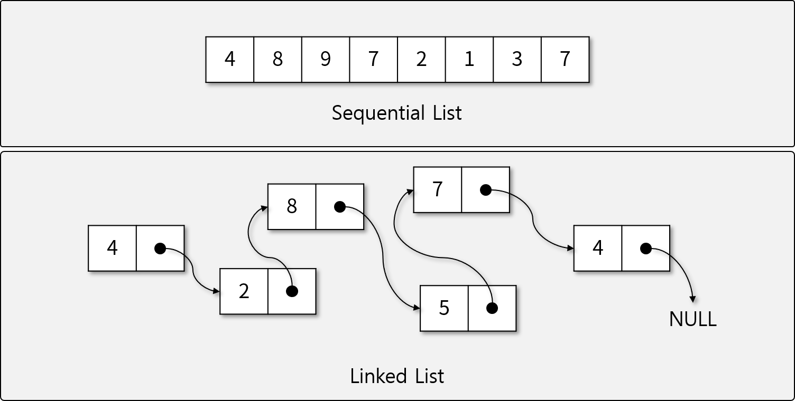
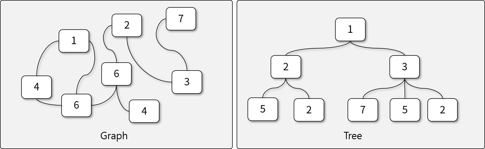
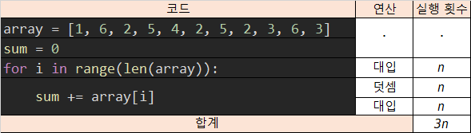
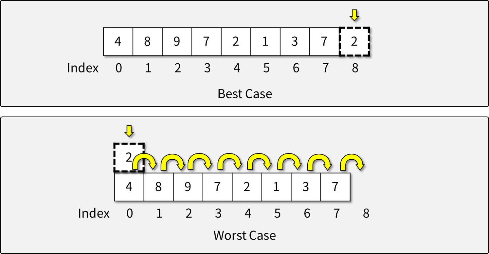
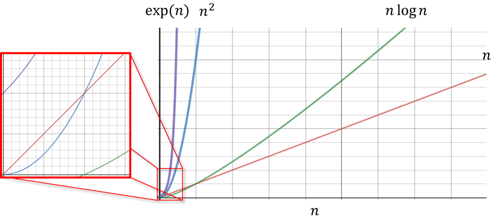
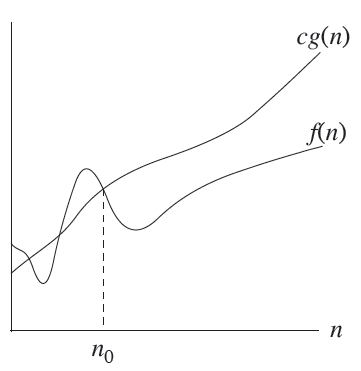
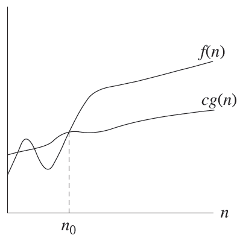
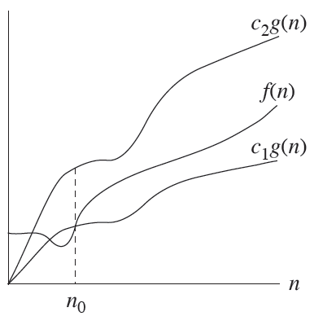

# 자료구조

## 자료 와 정보
* 자료 
    - 현실세계로부터 수집한 사실이나 개념의 값 또는 이들의 집합, 가치관 없이 단순히 취득된 것
    - 예 - 학생들이 받은 점수 수집한 사실(IQ,EQ)같은 개념 적인 값 A,B반이 받은 점수들, 전체적인 값도 데이터라고 부른다.  키, 몸무게 등등

* 정보 
    - 자료를 특정 용도로 사용하기 위해 가공한 것, 가치관을 가지고 계산되고 비교되는 것
    - 예 - A,B반의 각 반의 순위를 비교하기 위해 구한 평균을 정보라고 부른다.

## 자료 구조
* 자료구조 
    - 자료들의 모임, 관계, 자료들에 적용할 수 있는 함수나 명령
    - 예1 - 학생들의 점수를 나타낸다고 했을 때 1번학생은 97점 2번 학생은 88점 3번 학생도 97점이라고 하면 이렇게 각각의 학생들의 점수를 순서로 정의함으로써 리스트 관계를 정의하는 것
    - 예2 - 계층 관계처럼 할아버지 할머니 세대 밑에 아버지 어머니 세대가 있고 그 다음으로 손자손녀 세대가 있는 것처럼 이런 트리 구조를 갖는 것도 자료구조이다.
    - 순서가 있는 자료구조는 중간에 자료를 삭제해도 삭제된 다음 자료가 이어서 순서를 가지면 되니 순서를 갖는것이 유지 되지만,  트리 형태의 자료구조는 중간에 있는 자료구조가 사라지게 되면 중간 자료를 매꾸기 위한 특별한 동작이 필요하다. 사이드 이팩트를 없애기 위한 추가 작업이 필요한 것이다. 이런 것이 특별한 함수나 명령을 의미한다.
    - 자료구조를 이런 자료들의 모임, 관계, 자료에 적용할 수 있는 함수나 명령 자바 클래스를 생각했을 때 메소드를 같이 배우는 것이다. 이런 것들을 생각하면 된다.

### 자료구조의 특징

- 특징들을 고려해서 설계되어야 한다.
- 효율성 - 자료구조가 만능이 아니기 때문에 특정한 상황에서 효율성이 좋아야 한다. 모든 상황에서 좋은 효율을 자랑하는 자료구조는 없다..
- 추상화 - 인터페이스를 사용하듯이 추상화된 클래스 즉 자료구조가 있고, 이 자료구조 내부에서 실제 이 자료구조를 구현하기 위한 방법들이 복잡하게 동작되어 있는데 이것들을 신경쓸 필요 없이 인터페이스를 알고 활용 할 수 있으면 된다.
- 재사용성 - 추상화를 할 때 재사용성을 같이 고려해야 한다. 재사용성이 좋다하는 것은 특별한 상황에 효율이 좋은 것보다 효율을 낮추더라도 일반적인 상황에서 사용할 수 있게 다양하게 쓸 수 있게 만드는 것이다.

### 자료구조의 종류


### 선형 자료구조



- 선형 자료구조는 af(x) = f(ax), f(x) is linear 선형의 기본 개념이다 1자로 연결 되어있는 것이다.

### 비선형 자료구조



- 선형으로 연결되지 않은 모든 자료 구조를 말한다.  막 꺽여있는 구조. 데이터가 있으면 두갈래가 되고 돌아오는 것도 있고 1자로 되어있지 않은 것
- 비선형 구조를 가장 일반적으로 표현하는 자료구조를 Graph라 한다.
- Tree 구조가 많이 사용된다.

### 자료구조의 필요성

> 기본적으로 프로그램을 구현하면 다양한 자료를 임시적으로 메모리에 올리거나 영구적으로 파일 시스템, 데이터베이스에 저장하여 사용한다.
자료구조의 선택은 (자료를 어떻게 저장하는지에 따라) 프로그램에 중대한 영향을 끼친다

> 우리가 자료구조를 선택하는것은 효율적으로 빠르게 접근할지, 저장장치를 효율적으로 사용할지에 대한 트레이드 오프이다.

1. 효율적으로 빠르게 접근할 수 있는지가 결정된다
h2 DB를 쓴다했을 때 학생의 id와 점수가 있는데 한 번 받아오는데 20초가 걸린다하면 이 데이터베이스는 안쓰게 될것이다
2. 자료의 중복을 최소화하여 저장장치를 효율적으로 사용할 수 있다.
3. 자료구조를 잘 선택하면 알고리즘을 기계적으로 적용할 수 있다
가장 효율적으로 계산할 수 있는 알고리즘 내부적으로 가지고 있다
그래프라는 자료구조를 표현 안했다면 다익스트라 알고리즘을 사용할 수 없고 그래서 자료구조를 잘 선택해야 알고리즘을 잘 사용할 수 있다.
4. 동료들과 협업하는데 큰 도움이 된다(잘못된 창의성을 발휘하지 않게 도와준다.)
무슨 자료구조 알고리즘을 써서 해결했다고 말하면 되는데 그런것을 모르고 사용했다 하면 협업을 할수없다

* 제대로된 문법과 형태를 갖춰서 사용하도록 하는게 자료구조이다.

## 알고리즘

- 알고리즘이란 - 문제를 해결하기 위한 여러 동작들의 모임.
- 여러 동작이라는 것이 명확해야 한다.

### 조건

- 입력 - 외부에서 제공되는 자료가 존재한다. (소팅 알고리즘 이라고 하면 소팅되어있는 리스트나 혹은 안되어 있는 리스트)
- 출력 - 적어도 2가지 이상의 다른 결과를 출력해야 한다. 입력이 같은데 다른 결과가 나와야한다는게 아니라 입력이 달라지면 결과가 달라질 수 있어야 한다는 것이다. 반드시 달라야하는것도 아님..
    - 즉, 모든 입력에 대해 동일한 출력을 내면 안된다. 입력이 여러개 일 때 출력이 하나 일순 있는데 입력이 하나인데 출력이 여러개 일 순 없다.
    - 입력이 달라지면 다른 출력이 최소한 하나는 더 있어야 한다 무슨 복잡한 계산을 해도 결국 출력이 0이라고하면 앞의 과정이 의미가 없어지게 되니깐 그래서 최소한 2가지 출력이 있어줘야한다. 대표적으로 입출력이 2개인것 true,false가있다.
- 명확성 - 수행과정은 명확한 명령어로 구성되어 있어야 한다. 딱 너는 어떤 동작을 하도록 해 이렇게 명확하게 명령해줘야 한다.

    예로 강단뒤에 앉은 사람을 앞줄에 앉힐 때 이런 명령어를 통해 로직을 구현한다.
    ```text
      while not_done {-> 더 옮길 수 있고 사원일 경우
  
      1. 맨앞에 맨왼쪽에 앉은 사람을 선택
      2. 더 앞으로 갈 수 있는지 확인
      3. 가능하면 앞으로 한칸 옮긴다.
      4. 더 앞으로 못가면 제외한다.
      }
    ```
    

* 유한성 - 유한한 시간안에 종료되어야 한다. 무한루프가 있으면 안된다. 무한하게 돌고 있으면 알고리즘이 아니다.

* 효과성 - 모든 과정은 사람이 종이와 연필로 유한한 시간 안에 수행할 정도로 단순/명백해야 한다.

### 알고리즘의 필요성

#### 서비스의 규모

- 서비스의 규모가 엄청 커지고 아이템이 수백만 수천만개가 되고 이용자의 수도 점점 규모가 커지기 때문에 알고리즘이 필요하다.
- Navie한 방식으로 데이터를 실시간으로 다룰 수 없다.

#### 컴퓨터의 연산속도와 비용

- 최근에는 많은 기업이 클라우드로 서비스를 제공한다.
    - 물리적으로 서버를 구매 관리 유지 하지 않아도 되고 서버 액세스가 급격하게 증가하면 유연하게 인스턴스 수를 늘리도록 대처 할 수 있다.
    - 보안과 안전성 등 소규모 기업이 직접 해결하기 어려운 문제를 쉽게 해결 할 수 있다.
- 연산 = 비용
    - 서버를 임대하기 때문에 서버의 스펙과 시간에 비례해서 돈을 내게 되어있다.
    - 더 좋은 알고리즘으로 연산속도를 개선할 경우, 더 낮은 서버 스펙으로도 동일한 서비스를 제공할 수 있다.
    - 동일한 batch 작업에 더 좋은 알고리즘을 사용할 경우 동일한 서버 스펙으로 더 짧은 서버를 임대해도 동일한 결과를 얻어낼 수 있다.
    - 인프라를 사용하는 것과 직결되기 때문에 알고리즘을 잘 적용하는 것으로 수억 수천만원을 아낄 수 있다.

### 알고리즘의 복잡도(Complexity)

- 알고리즘의 복잡한 정도는 크게 두가지로 나누어 볼 수 있다.
    - 공간 복잡도 vs 시간 복잡도 → 일반적으로 두 복잡도는 Trade-off 관계에 있다. 시간복잡도를 적게 가져 갈려면 공간복잡도 메모리를 많이 써야 한다
- 알고리즘의 복잡도가 높을 수록 알고리즘을 구동하는데 많은 Cost가 소비된다.
    - 코스트는 클라우드를 사용하면서 스펙을 올린다거나 시간을 늘어난다거나 더 많은 비용을 내게 되는데 이런 비용으로서의 코스트
    금전적인 코스트와 엔지니어링의 코스트가 있는데 여기선 엔지니어링의 코스트이다.

### 공간 복잡도

- 알고리즘이 동작하기 위해 필요한 공간(메모리)의 크기
- 많은 경우, 연산의 중간 결과를 저장하기 위해 메모리를 소비한다.
    - 중간 결과를 저장하여 중복 연산을 줄일 수 있다.

### 시간 복잡도

> 알고리즘이 동작하는데 걸리는 시간 또는 연산의 횟수, 연산의 횟수로 이야기 하는게 더 좋다
왜냐하면, 똑같은 알고리즘이여도 서로 다른 머신에서 동작을 할 때 아이폰이랑 슈퍼컴퓨터에서 동작할 때 당연히 슈퍼컴퓨터가 빠르니깐 시간으로 따지는 것보다 연산의 횟수가 더 좋다.

### 오해 하지 말아야 할점

> 어떤 알고리즘이 있으면 공간복잡도가 증가시키면 무조건 시간복잡도가 감소하지 않는다.. 더 안좋게 될 수도 있따.
상황에 따라 알고리즘의 성능 차이가 존재한다는 것이다.  좋은 알고리즘과 나쁜 알고리즘이 있다는 것

> 복잡도 사이의 트레이드 오프가 있다는 것은 최적의 알고리즘을 사용하는 것이 아닐 때를 말하는 것이다.
최적의 알고리즘이 아닐 때, 공간복잡도를 늘려 시간 복잡도를 줄이거나 시간복잡도를 늘려 공간복자도를 줄이는 식이라는 것이다.
무조건 트레이드오프 관계는 아니라는 것이다.

### 복잡도의 계산 방법

- 측정 - 알고리즘을 구동하면서 Elementary Operation(기본연산- 대입, 덧셈같은 가장 작은 연산을 의미)의 횟수를 카운팅하여 측정할 수 있다.

```java
int count = 0
int[] array = {1, 6, 2, 5, 4, 2, 5, 2, 3, 6, 3}

int sum = 0
for (int i = 0; i < array.length; i++) {
    count += 1 // 루프 조건 확인
    sum += array[i]
    count += 1 // 덧셈 연산
    count += 1 // 대입 연산
}
count += 1 // Branch
System.out.println(sum)
System.out.println(count)
```

- 조건들 확인해주고, 덧셈연산 대입연산하나하나 세주는 것이다.
- 브랜치는 마지막 루프 조건 확인이 브랜치이다(반복문에서 마지막에 array.length보다 크게 되면 반복문을 종료하게 되니깐 이런 조건식도 확인을 한것이니 마지막에 브랜치로 추가시킨 것이다.) 모든 요소가 다 카운트된 만큼이 이 알고리즘의 계산 복잡도
- 논란의 여지가 굉장히 많음 기본 연산의 기준을 어디까지 보느냐의 차이가 있다. (sum = 0; 이것도 어떻게 보면 기본연산이라고 할 수 있기 때문에)

- 분석 - 반복문과 조건문을 고려하여 분기별로 실행 횟수를 분석을 통해 알아낼 수 있다.
    - 이것이 더 정확한 방법
    - array가 n개가 있다하면 for문은 n번 동작한다.
    i에 대입되는연산이 n번 동작, sum에 덧셈과 대입 연산이 n번씩 동작해서 합치면 3n이 된다.
    리니어하게 쭉 증가하는 시간복잡도가 증가하는 알고리즘이다.
    자료가 10만개면 30만이라는 시간복잡도를 가지게 된다는 것



### 복잡도의 종류

- 알고리즘 동작 상황에 따른 그분
    - 최악의 경우
    - 최선의 경우
    - 평균적인 경우



- 일반적으로 `최악의 경우` 에 대해 알고리즘 복잡도를 정의한다.
- List에 값을 넣는다 했을 때 맨 마지막에 값을 넣으면 복잡도가 1이다.(베스트)
- 맨 앞에 넣으려고 하면 원래 있던 값들을 한 칸씩 뒤로 미뤄야 하니깐 n개의 값들을 넘겨주고 1개를 넣어야 하니깐 복잡도는 n+1이다(워스트)
- 평균적인 경우는 모든 경우의 수를 계산해서 구한다(n+1)(n+2)/2(n+1)로 해서 구한다. 매번 평균을 따져서 구하는게 힘드므로 특수한 경우에 평균을 따져서 구한다.
    - 예를 들어 O(NlogN) 가지는 소팅이 여러개 있는데,  그 중 다 장단점이 있다 그래서 좀 더 이상의 것을 따져줘야할 때 평균의 경우를 사용한다.

## Asymptotic Notations



- 시간복잡도를 있는 그대로 사용하기엔 너무 다양하게 나온다 이런걸 통합해서 관리할 필요가 있어서 두 개의 알고리즘을 비교하고 싶을 때, 수식을 직접 비교하기엔 무리가 있어서 쉽게 비교하고 더 직관적으로 받아들이기 위해 이 노테이션을 사용한다.
- 점진적 표기 방법
    - 점진적은 LIMIT를 의미한다. n^2이 있고, n에 대한 그래프가 있을 때 특정 지점에서 n^2이 무조건 n보다 크게 되니깐 더 이상 역전이 일어나지 않는 시점 이후를 의미한다. 그래서 이 방법으로 n^2 이 n보다 크다라는 걸 의미한다.
    - 결과가 어떻게 되는지만 알면 된다.
- 알고리즘에 입력되는 자료의 개수가 충분히 많다고 가정한다
    - 입력 자료의 개수가 작은 경우 비교하는 의미가 크게 없기 때문에
- 성능 평가에 공평한 비교를 위한 성능 분석 기준으로 사용한다.
    - 동작 시스템(시간에 영향을 줄 수 있는데 시간을 버리고, 연산횟수만 가지고 비교하기 때문에), 데이터 크기 등을 배제하고 성능을 비교하기 위해 필요
- 상한 하한 상한과 하한의 교집합으로 정의한다.

### Big-O Notation



- 복잡도의 순위
    - O(1) < O(logn) <O(n) <O(nlogn) <O(n^2) < O(2^n) < O(n!)
    - 순위가 작을 수록 크기가 빠른 것이다.

> f(n) 이  = n, n2, 3n+2 등이 있을 때 o(g(n))으로 바꾸는게 목표이다. O(n, n2, 3n+2) 로 f(n)이 g(n)에 대체 되어 들어간다. 

> 점진적 방법은 더 이상 역전이 일어나지 않는 어떤 숫자보다 큰 n에 대해서만 따지니깐 no이니깐 그 이후만 보면 된다.

> 우리가 가지고 있는 시간복잡도가 f(n)인데 빅오로 표현할 수 있는 것은 0보다 큰 상수를 곱해서 f(n)보다 더 높은 위치에 올릴 수 있으면 빅오노테이션을 쓸 수 있다라고 이해 하면 된다.

> 예로 f(n) 이 n2+3 일 때 g(n)이 n2 c가 2라고하면 2n2이 되니깐 특정 지점 이후부터는 g(n)이 커질 수 밖에 없으니깐 O(n2)으로 쓸 수 있는 것이다.
 빅오 노테이션은 집합이다 O(N2)  ← 다양한 f(n)이 속하게 된다 n2*c보다 아래에 존재하는 f(n)은 다 포함이 되는 것이다.
 o(n2) - > n2이 최고차수인 것들이 다 포함된다.
 o(logn) < o(n)이기 때문에  o(logn) 이것도 포함
 n2보다 느리기만 하면?(작기만하면) 다 들어간다. 3n, 4등도 포함 가능.
 즉, O(n2) 일 때 3n2+2n+1,3n, 4등이 포함된다는 것이다.

### Big-Omega Notation



* 오메가(n2)  이면 n2+4n+1, 9n3, 2^n+9n2 이 포함된다. 이것보다 빠른 것들(?, 큰것들)은 다 들어간다.

### Big-Theta Notation



* 빅오 노테이션에도 들어가고 빅 오메가 노테이션에도 들어가야 빅세타 노테이션에도 속한다.
* 즉 빅오(n2)이고, 오메가(n2) 이라고 하면 세타는 n2+3n, 3n2 +3n 등 n2이 최고 차수인 것들만 들어갈 수 있는 것이다. 3n , 4n3 못들어간다 n2으로 표현되는 것들만 들어갈 수 있다. 정확히 일치하는 것만 들어간다.

### 빅 오를 주로 쓰는 이유는?

* 구현을 하는데 구현을 한 경우가 O(n)에 속한다 했을 때는 O(n), O(1)일 수 있는데 검증하지 않고 O(n)으로 동작한다고 할 수 있다. 복잡도가 복잡해지고,  상황에 따라 달라지는게 있다보면,  상수 시점에 동작하는 것이다 라고 이야기하기 어려운게 있따 증명하기 어려운 것들이 생겨서 세타로 딱 이것이다라고 표현하기 어려운 것이다. 그래서 O(n)로 표현하면 O(n)과 O(1)이 포함되는 것이니깐 더 큰 범위의 것을 써서 좀 더 표현하기 쉬운걸 사용하는 것이다. 즉 n이라고하면 3n, 5 .. 이런것들을 다 사용할 수 있는 것이다.

### 주의!

* 그래프 상으로 위에 있는게 더 느린 것이다. 왜냐하면 시간복잡도가 더 높은 거니깐 속도가 느린 알고리즘이다.
* 그래프상에서 증가하는 속도는 빠른 것이다.
* 스몰 오 노테이션이 있는데 n2보다 작은 것들이 포함되는 것이다 잘 쓰이지 않음