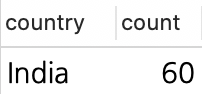
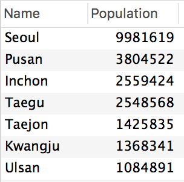
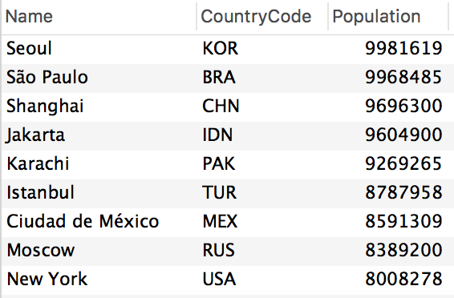
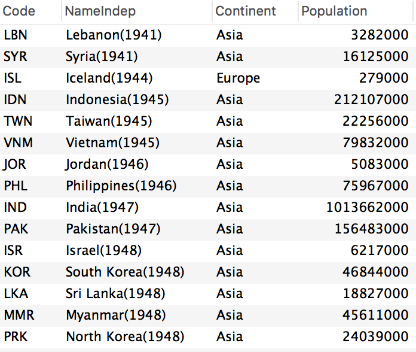
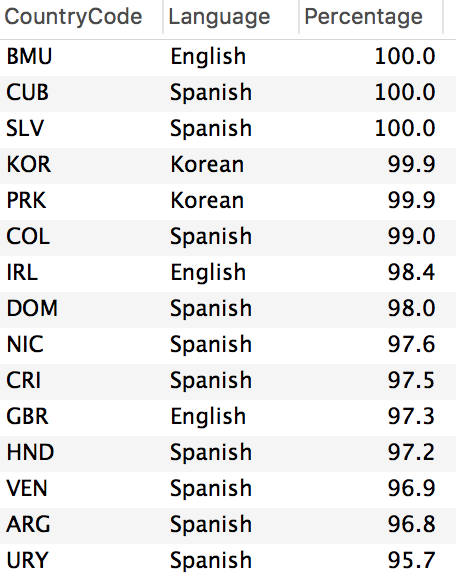
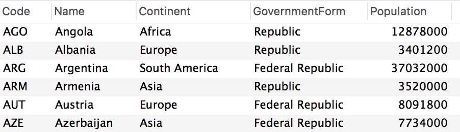
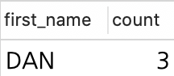
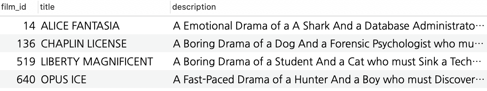
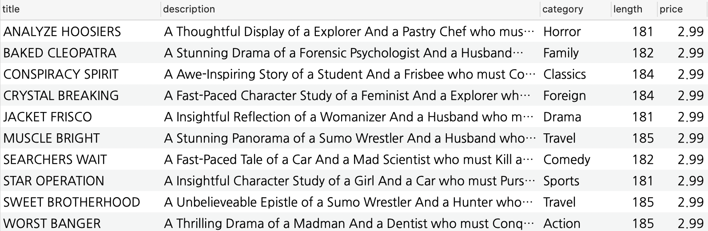

# Quiz 1

### 1. Sakila 데이터 베이스에서 국가가 인도 고객의 수를 출력하세요.

```roomsql
SELECT country, count(country) AS count
FROM customer_list
WHERE country = 'India';
```
### 2. 한국 도시중에 인구가 100만이 넘는 도시를 조회하여 인구순으로 내림차순하세요.

```roomsql
use world;
SELECT name, Population
FROM city
WHERE countrycode='KOR' AND Population >  1000000;
```

### 3. city 테이블에서 population이 800만 ~ 1000만 사이인 도시 데이터를 인구수순으로 내림차순하세요

```roomsql
SELECT name, countrycode, population
FROM city
WHERE Population BETWEEN 8000000 AND 10000000
ORDER BY population DESC;
```

### 4. country 테이블에서 1940 ~ 1950년도 사이에 독립한 국가들을 조회하고 독립한 년도 순으로 오름 차순 하세요.

```roomsql
SELECT code, concat(concat(name, '('), concat(indepyear,')')) as nameindep, continent, population
FROM country
WHERE indepyear BETWEEN 1940 AND 1950
ORDER BY IndepYear ASC;
```

### 5. contrylanguage 테이블에서 스페인어, 한국어, 영어를 95% 이상 사용하는 국가 코드를 Percentage로 내림차순하여 아래와 같이 조회하세요.

```roomsql
SELECT countrycode, Language, Percentage
FROM countrylanguage
WHERE Language IN ('English','spanish','korean') AND Percentage >=95
ORDER BY Percentage DESC;
```

### 6. country 테이블에서 Code가 A로 시작하고 GovernmentForm에 Republic이 포함되는 데이터를 아래와 같이 조회하세요.

```roomsql
SELECT code, name, continent, governmentform, population
FROM country
WHERE code LIKE "A%" AND GovernmentForm LIKE '%republic%';
```

### 7. sakila actor 테이블에서 first_name 이 DAN인 배우의 수를 출력하세요.

```roomsql
USE sakila;
SELECT first_name, count(first_name) AS count
FROM actor
WHERE first_name='DAN';
```

### 8. Sakila film_text 테이블에서 title이 ICE가 들어가고 description에 Drama가 들어간 데이터를 출력하세요.

```roomsql
SELECT *
FROM film_text
WHERE title LIKE '%ice%' AND description LIKE '%drama%';
```

### 9. Sakila 데이터 베이스의 film_list 뷰에서 price가 1~4, length가 180 초과, category는 Sci-Fi과 Animation이 아닌 데이터를 출력하세요.

```roomsql
SELECT title,  description, category, length, price
FROM film_list
WHERE price BETWEEN 1 AND 4 AND length >180 AND category NOT IN('sci-fi','animation');
```

  
