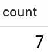
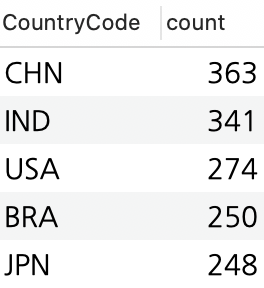
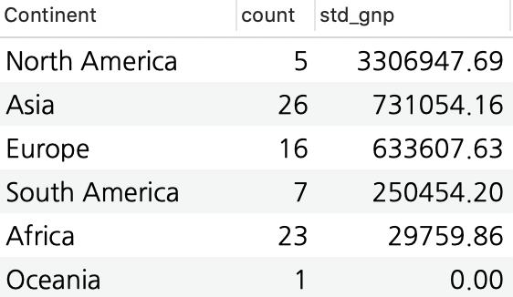
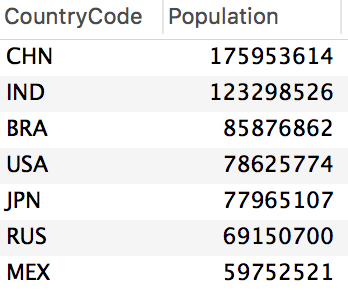
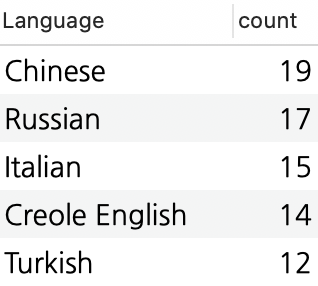
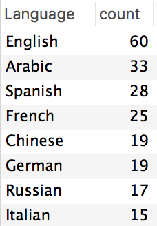
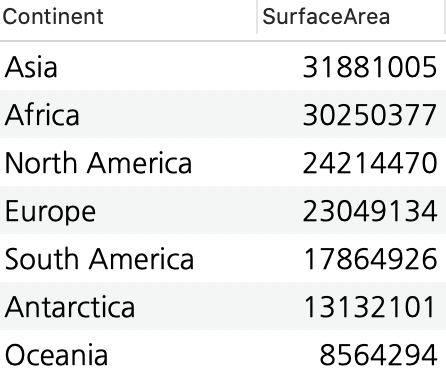

# Quiz2 - group by & having
## World 데이터베이스
* USE world;

### 문제 1. 전체 몇개의 대륙이 있는지 출력하세요.

```roomsql
SELECT  count(DISTINCT continent) AS count
FROM country;
```

### 문제 2. 국가 코드별 도시의 갯수를 출력하세요 (상위 5개를 출력)

```roomsql
SELECT CountryCode, count(CountryCode) AS count
FROM city
GROUP BY CountryCode
ORDER BY count DESC
LIMIT 5;
```

### 문제 3. 대륙별 몇개의 나라가 있는지 대륙 별 나라의 갯수로 내림차순하여 출력하세요.

```roomsql
SELECT continent , count(continent) AS count
FROM country
GROUP BY Continent
ORDER BY count DESC;
```

### 문제 4. 대륙별 인구가 1000만명 이상인 나라의 수와 GNP의 표준 편차를 출력하세요 (GNP 표준편차로 내림차순)

```roomsql
SELECT Continent, count(Continent) AS count, round(stddev(gnp),2) AS std_gnp
FROM country
WHERE Population >= 10000000
GROUP BY Continent
ORDER BY std_gnp DESC;
```


### 문제 5. city 테이블에서 국가코드 별로 총 인구가 몇명인지 조회하고 총인구 순으로 내림차순하세요(총 인구가 5천만 이상인 도시만 출력)

```roomsql
SELECT countrycode, sum(population) AS population
FROM city
GROUP BY CountryCode HAVING population >= 50000000
ORDER BY Population DESC;
```

### 문제 6. 언어별 사용하는 국가수를 조회하고 많이 사용하는 언어를 6위에서 10위까지 조회하세요.

```roomsql
SELECT Language, count(Language) AS count
FROM countrylanguage
GROUP BY Language
ORDER BY  count DESC
LIMIT 5,5;
```

### 문제 7. 언어별 15곳 이상의 국가에서 사용되는 언어를 조회하고, 언어별 국가수에 따라 내림차순하세요.

```roomsql
SELECT Language, count(Language) AS count
FROM countrylanguage
GROUP BY Language HAVING count >=15
ORDER BY count DESC;
```

### 문제 8. 대륙별  전체 표면적크기를 구하고 표면적 크기 순으로 내림차순하세요.

```roomsql
SELECT Continent, round(sum(SurfaceArea),0)  AS surfacearea
FROM country
GROUP BY Continent
ORDER BY SurfaceArea DESC;
```
