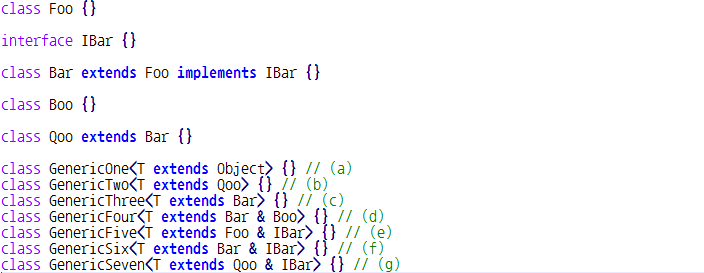
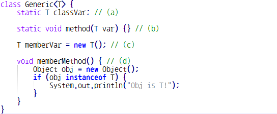

# Quiz 10 오답 정리
  
### Q1. 다음 중 제네릭 클래스에 대한 설명으로 옳지 않은 것은? * `답 : 3번`
1. 제네릭 클래스에서는 정적 변수의 자료형으로 타입 파라미터를 사용할 수 없다.
2. 제네릭 클래스는 타입 파라미터를 이용하여 클래스가 사용될 때 자료형을 입력받는다.
3. 제네릭 클래스에서는 정적 메소드를 사용할 수 없다.
4. 제네릭 클래스에서는 타입 파라미터 자료형으로 객체 생성이 불가하다.

* 정적 메소드를 사용할 수 있는데 타입제한이 있을 뿐이다.

### Q2. 제네릭 클래스의 상속에 대한 설명으로 옳은 것은? * `답 : 4번`
1. 제네릭 클래스는 generic 키워드를 생략하여 사용할 수 있다.
2. 제네릭 인터페이스를 다중 상속하는 경우, 제네릭 인터페이스 별로 반드시 별도의 타입 파라미터 변수를 사용해야 한다.
3. 부모 제네릭 클래스에서 사용한 타입 파라미터와 동일한 변수명을 사용해야 한다.
4. 자식 제네릭 클래스에서 추가적으로 타입 파라미터를 사용할 수 있다.

* 제네릭 클래스는 generic 키워드를 사용하지 않는다.
* 제네릭 인터페이스 별로 반드시 별도의 타입 파라미터 변수를 사용할 필요는 없다. 
* 부모 제네릭 클래스에서 사용한 타입파라미터와 다른 변수명을 사용할 수 있다.

### Q3. 다음 중 소스 코드에서 잘못된 부분을 모두 고르시오. * `답 : d`

* a,b,c 문제가 없다.
* d - Bar&Boo 클래스 다중 상속이 안되기 때문에 잘 못 되었다.
* e,g - 클래스 & 인터페이스이기 때문에 다 됨.
* f - Bar가 IBar에 상속하고 있지만 상관이 없음.

### Q4. 다음 중 오류가 발생하는 경우를 모두 고르시오. * `답  : a,b,c,d`

* 수업들으면서 나왔던 오류가 발생하는 모든 상황들이다. 알아두면 됨!

### Q5. 기본 자료형을 Wrapper 클래스 객체로 자동으로 전환하는 기능을 무엇이라 하는가? * 
* 답 : Autoboxing
