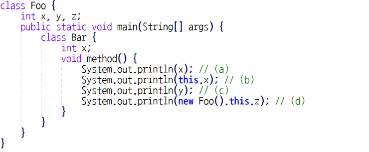
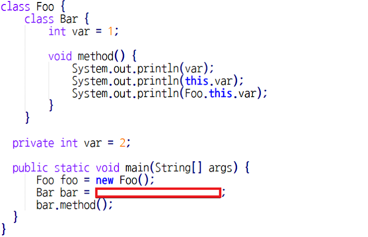

# Quiz 12 오답 정리
  
### Q1. 다음 중 예외처리에 대한 설명으로 옳지 않은 것은? * `답 : 3번`
1. 예외 처리는 try ~ catch 구문으로 해결하며, catch 구문은 다형성을 기반으로 객체를 받을 수 있다.
2. Unchecked exception의 경우 throws 키워드 없이도 예외의 위임 처리가 가능하다.
3. 예외 처리란, 프로그램이 더이상 동작할 수 없는 치명적인 오류가 발생했을 때 여기서 벗어나기 위한 로직이다.
4. 예외 처리 시 finally 구문은 switch문의 default와는 다르게, catch 구문이 동작해도 반드시 동작한다.
#### 문제 풀이
* 오류랑 에러가 발생하는게 다르다 오류가발생하면 프로그램이 종류가 되어야한다.
예외는 프로그램이 종료될 정도의 문제가 생기는게 아니라 다른 로직으로 동작되어야 하는 것이다.

### Q2. 클래스 내부 클래스와 인스턴스 내부 클래스에 대한 설명으로 옳은 것을 고르시오. * `답 : 3번`
1. 래스 내부 클래스는 정적 멤버 변수를 가질 수 없다.
2. 인스턴스 내부 클래스에서는 정적 변수를 사용할 수 있다.
3. 모든 종류의 내부 클래스는 외부 클래스의 private 멤버 변수에 접근할 수 있다.
4. 클래스 내부 클래스와 외부 클래스의 멤버 변수의 이름이 같을 경우 this를 이용해 외부 클래스 멤버 변수를 지칭할 수 있다.
#### 문제 풀이
* 클래스 내부 클래스는 정적 멤버 변수를 가질 수 있다.
* 인스턴스 내부 클래스에서는 정적 변수를 사용할 수 없다 상수는 사용가능
* 클래스내부클래스이기때문에 외부클래스의 객체를 만들고 객체명점.멤버변수로 접근해야한다.

### Q3. 다음 중 소스 코드에서 잘못된 부분을 모두 고르시오. * `답 : c,d`

#### 문제 풀이
* 메소드 내부 클래스에서 y가 없기 때문에 잘 못 되었다. Foo클래스의 y를 가리키지 못한다.
* new Foo().this 가 중첩된다 이미 new Foo()가 객체를 의미하는데 거기서 한 번 더 this로 객체를 또 가리키는 경우이다.
그래서 잘 못된 코드이다.

### Q4. 다음 빈 칸에 들어갈 코드를 작성하시오. * 

* 답  : foo.new Bar()

### Q5. 로컬 내부 클래스 중, 이름이 없어 즉시 한번 사용 가능한 클래스를 무엇이라고 하는가? *
* 답 : 익명 내부 클래스