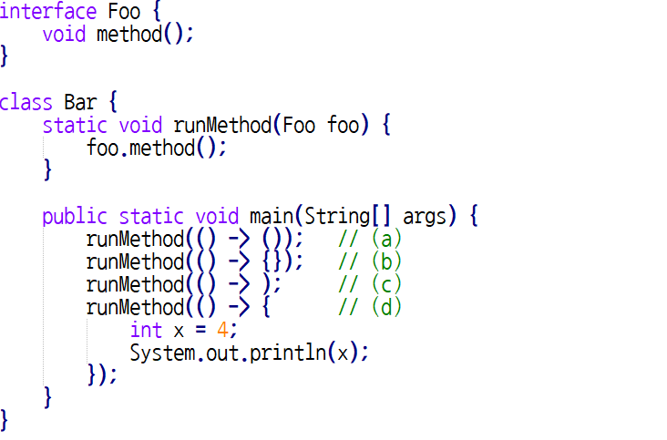
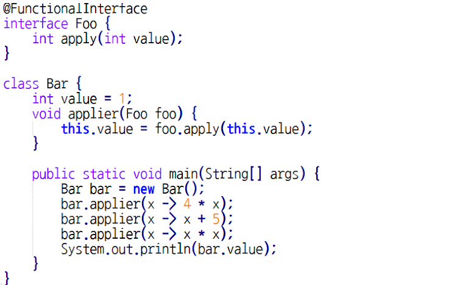

# Quiz 13 오답 정리
  
### Q1. 다음 중 람다식에 대한 설명으로 옳지 않은 것은? * `답 : 3번`
1. 한 줄의 Expression만으로 구성된 람다식은 Expression 결과를 반환하며, 이를 expression lambda라고 한다.
2. 람다식을 사용하기 위해서는 반드시 @FunctionalInterface 애노테이션이 선언되어 있을 필요는 없다.
3. 익명의 로컬 내부 클래스와 람다식은 완전히 동일하며, 문법을 단순화해서 적은 것에 불과하다.
4. 람다식은 객체지향 프로그래밍을 더 효율적으로 실현하기 위해 고안되었다.
#### 문제 풀이
* 익명의 로컬 내부 클래스와 람다식은 거의 비슷하나 각각 this를 활용하여
객체를 가리킬 때 가리키는 객체가 다르다. 익명 로컬 내부 클래스는 자신의 익명 객체를 가리키지만,
람다식은 외부 클래스의 객체를 가리킨다.
 
### Q2. 다음 중 람다식으로 사용이 불가능한 표현을 모두 고르시오. * `답 : 1,2,5번`
1. (x) -> {int x = 4; return x;}
2. () -> () 
3. () -> {}
4. x -> x
5. -> 4
#### 문제 풀이
* 1번은 (x) 와 int x 가 겹쳐서 안된다.
* 2번은 괄호안에는 반드시 expression이 들어가야 한다.
* 5번은 입력파라미터가 없는 경우 ()을 사용한다, 생략 불가.

### Q3. 다음 중 소스 코드에서 잘못된 부분을 모두 고르시오. * `답 : a,c`

#### 문제 풀이
* a - 괄호안에는 expression이 있어야 한다.
* c - 작성이 되야하는 곳에 아무것도 없으면 안된다. expression이든 중괄호블럭이 있어야한다.

### Q4.  다음 소스코드의 실행 결과를 적으시오. *

* 답 : 81

### Q5. 객체지향 프로그래밍 기법과 다르게, 불필요한 코드를 없애고 비즈니스 로직에 집중하는 프로그래밍 기법을 무엇이라 하는가? *
* 답 : 함수형 프로그래밍

