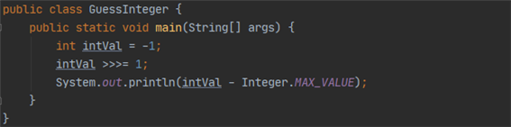
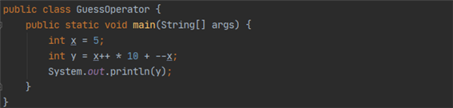

# Quiz 2의 오답정리
###Q1. 다음 중 변수와 자료형에 대한 설명으로 옳지 않은 것을 고르시오. `답 : 3번`
1. 정수 리터럴은 기본적으로 int 자료형이다.
2. long 리터럴은 정수 리터럴 뒤에 L 또는 l을 붙여 표기한다.
3. long 변수는 float 변수보다 많은 메모리를 사용하므로 더 표현 범위가 넓다.
4. boolean 변수에는 논리형 리터럴인 true와 false만 대입할 수 있다.

* long 변수는 float 변수보다 2배 더 많은 메모리를 사용하지만, 
부동 소숫점 방식인 float 변수가 표현할 수 있는 범위는 훨씬 넓다.

### Q2. 다음 중 변수명으로 사용할 수 있는 것은? `답 :3번`
1. class
2. _^_^_
3. 이것도_너프해_보시지
4. 3thWord

* 변수명으로 키워드를 사용할 수 없고, 특수문자를 사용할 수 없다
* 한글로 쓰는 것도 가능하다.
* 숫자로 시작할 때는 _기호를 앞에 써서 사용한다.

### Q3. 아래 코드를 실행한 결과를 쓰시오. `답 : 0`

* -1 = 0b11111111111111111111111111111111
* -1 >>> 1 = 0b01111111111111111111111111111111 = Integer.MAX_VALUE

### Q4. 아래 코드를 실행한 결과를 쓰시오. `답 : 55`

1. x++에서 x는 5로 평가되며, 평가 후 6이 됨.
2. --x에서 x는 5가 된 후에 평가됨.
--> y = 5 * 10 + 5 = 55

### 5번 문제 잘 못 출제 됨!