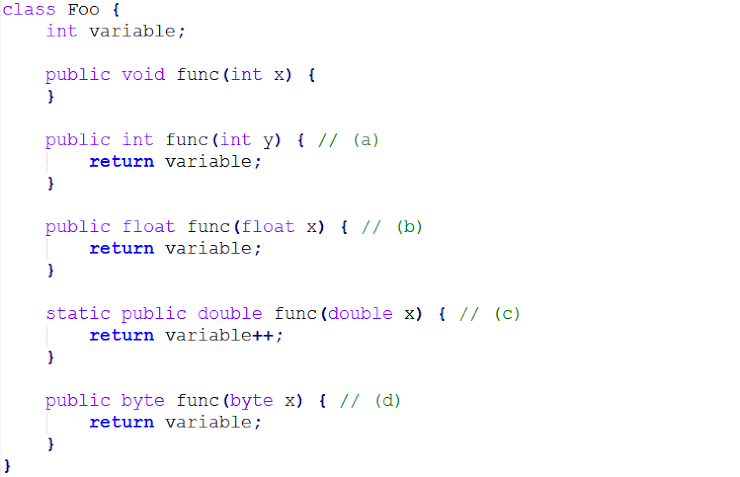
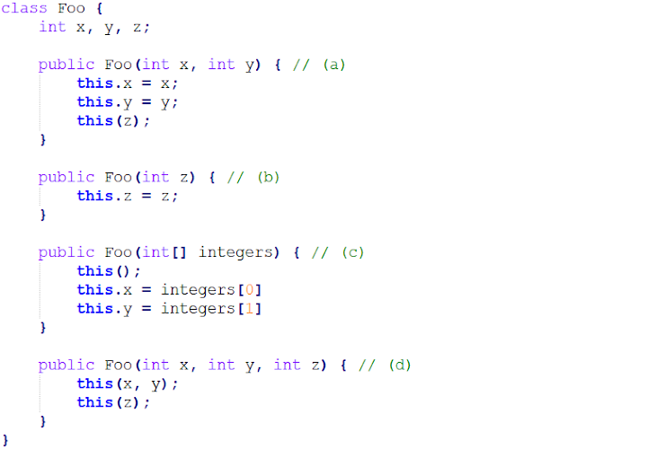

# Quiz 6 오답 정리 및 복습

 
### Q1. 다음 중 클래스와 객체의 메모리 구조에 대한 설명으로 옳은 것을 모두 고르시오 * `답 : 1번`
1. 위 설명은 모두 옳지 않다.
2. 코드상에서 클래스 영역에 선언되는 모든 변수는 클래스 영역 메모리에 생성된다.
3. 객체는 힙 영역에 생성되므로, 객체에 속하는 메소드의 로컬 변수도 힙 영역에 생성된다.
4. 메소드 내에서 생성된 모든 로컬 변수의 생명 주기는 메소드가 종료될때 까지 이다.
5. 정적 메소드 내에서 생성된 로컬 변수는 정적 변수이므로 클래스 영역에 생성된다.

* 메소드 내에서 생성된 로컬 변수의 생명주기는 중괄호 내에서만 유효하다.
  * 파라미터는 호출될 때 생명이 시작하고, 메소드가 끝나면 소멸된다.
  * 인스턴스 멤버 변수는 객체가 생성될 때 생명이 시작하고, 그 객체를 참조하고 있는 다른 객체가 없으면 소멸된다.
  * 클래스 멤버 변수는 클래스가 생성될 때 생명이 시작하고, 자바 프로그램이 끝날 때 소멸된다.

 
### Q2. 다음 코드에서 오류가 발생하지 않는 메소드를 고르시오. * `답 : b`

* a는 바로 위에 메소드와 겹쳐서 결과 값이 달라지는게 없다. 문법상 오류발생
* c는 static 메소드안에 인스턴스 멤버 변수를 사용할 수 없다.
* d는 반환값이 반환자료형보다 크기때문에 오류가 발생한다. (자료형이 다름)

### Q3. 다음 중 정상적으로 동작하는 생성자를 고르시오. * `답 : b`

* a,d는 this()의 호출은 가장 첫 줄에만 사용 가능
* c는 this() 기본 생성자가 존재 하지 않기 때문에 에러

### Q4. 클래스의 Getter와 Setter에 대한 설명으로 옳지 않은 것을 고르시오. * `답 : 2번`
1. Getter는 객체의 속성 값을 반환한다.
2. Setter는 값을 입력받아, 객체의 속성 값을 반드시 변경한다.
3. Getter를 구현하더라도 Setter를 반드시 쌍으로 구현할 필요는 없다.
4. Getter와 Setter는 정보의 은닉/보호를 강화하는 캡슐화(Encapsulation)을 수행하는 방법 중 하나이다.

* Setter는 값을 입력받아, 속성을 반드시 변경해야 하는 것은 아니다.

 
## Q5. 다음 중 의미하는 바가 다른 용어를 고르시오. * `답 : 4번`
1. 팀장님이 말씀하시는 "그 Class name으로 access하는 method 있잖아,"
2. Class method
3. Static method
4. Instance method

