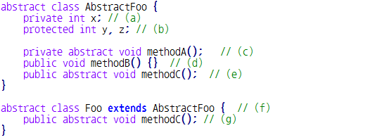
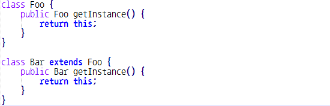

# Quiz 8 오답 정리
###  Q1.다음 중 클래스와 객체에 대한 설명으로 옳지 않은 것은? * `답 : 1,4번`
1. 자식 클래스 자료형의 변수가 참조하고 있는 객체는 부모 객체일 수 있다.
2. 자식 객체를 생성하면 부모 객체의 생성자가 먼저 호출된다.
3. 부모 클래스 자료형의 변수가 참조하고 있는 객체는 자식 객체일 수 있다.
4. 클래스 자료형으로 변수를 생성하면, 해당 클래스 자료형으로 객체가 하나 생성된다.

* 자식 클래스 자료형의 변수가 부모 객체를 참조하면 문법상으로는 오류가 나지 않지만 런타임에서 오류가 발생한다.
* 클래스 자로형으로 변수를 생성한다는게 객체가 생성된다는 의미가 아니다.

###  Q2.추상 클래스에 대한 설명으로 옳지 않은 것은? * `답 : 3번`
1. 추상 클래스의 자식 객체는 추상 클래스 자료형의 변수로 참조할 수 있다.
2. 추상 클래스를 상속하는 클래스는 모든 추상 메소드를 반드시 구현해야 한다.
3. 추상 클래스는 생성자가 존재하지 않는다.
4. 추상 클래스는 객체를 생성할 수 없다.

* 추상 클래스는 생성자가 존재한다.

### Q3. 다음 중 소스 코드에서 잘못된 부분을 모두 고르시오. * `답 : 3번`

1. a 
2. b 
3. c 
4. d 
5. e 
6. f 
7. g

* 추상 메소드는 자식 클래스에서 사용해야 하기 때문에 `public`이여야 한다.

### Q4. 다형성에 대한 설명으로 옳은 것은? * `답 : 5번`
1. 다형성은 객체지향 프로그래밍을 저해하는 요소로, 최소한으로 사용해야 한다.
2. 다형성은 상속 관계에서 의해서만 정의된다.
3. 다형성의 핵심 요소 중 하나인 메소드 오버라이딩은 포함 관계에서 정의된다.
4. 부모 클래스 자료형으로 참조중인 자식 객체는 항상 가상 메소드 호출 (virtual method call)이 이루어진다.
5. 위 보기 모두 옳지 않다.

* 다형성은 객체지향 프로그래밍의 핵심 요소이기 때문에 , 최소한으로 사용해야 하는 것은 아니다.
핵심요소이기 때문에 잘 활용을 해야 한다.
* 다형성에는 대표적으로 오버로딩,오버라이딩이 있다. 그러므로 꼭 상속 관계에서만 정의되는 것은 아니다.
* 다형성의 핵심 요소 중 하나인 메서드 오버라이딩은 상속 관계에서 정의된다.
* 부모 클래스 자료형으로 참조중인 자식 객체는 오버라이딩이 되어 있는 경우 가상 메소드 호출이 이루어진다.

### Q5. 다음과 같은 다형성을 가진 메소드를 무슨 타입이라고 하는가? * `답 : 공변 반환 타입`

