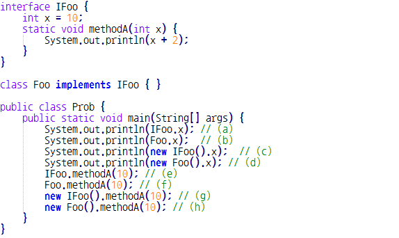
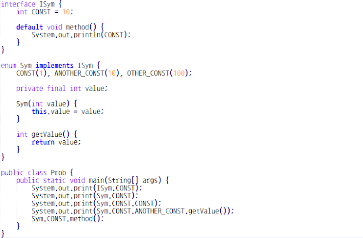

# Quiz 9 오답 정리

### Q1. 다음 중 인터페이스에 대한 설명으로 옳지 않은 것은? * `답 : 4번`
1. 인터페이스의 기본 메소드는 구현체 클래스에서 반드시 구현할 필요는 없다.
2. 인터페이스 자료형의 변수는 구현체 클래스 객체를 참조할 수 있다.
3. 따로 제한자를 명시하지 않으면 public abstract이다.
4. 인터페이스에는 추상 메소드와 기본 메소드만이 허용된다.

* 인터페이스에는 추상메소드와 기본메소드 뿐만 아니라 정적 메소드도 허용이 된다.

### Q2. 열거형 타입에 대한 설명으로 옳은 것을 고르시오. * `답 : 2번`
1. 열거형 타입에는 생성자가 허용되지 않는다.
2. switch ~ case 문에서 열거형 상수를 비교할 때에는 열거형 타입명을 생략한다.
3. 열거형 타입은 내부적으로는 추상 클래스이다.
4. 열거형 상수는 열거형 타입의 객체이므로, 사용할 때 마다 새로운 객체를 생성한다.

* 열거형 타입은 생성자를 허용하고, 일종의 클래스이다.
* 열거형 상수는 열거형 타입의 객체이므로, 처음에 한 번 객체를 생성한다.

### Q3. 다음 중 소스 코드에서 잘못된 부분을 모두 고르시오. * `답 : c,f,g,h`

(a) (b) (c) (d) (e) (f) (g) (h)

* 변수는 하위 클래스에서 접속 가능 하지만 메소드는 접속 불가.
* a,b 스태틱 변수에 접근하는 것은 됨.
* c - 인터페이스이기 때문에 객체를 만들 수 없어서 안됨
* d - 가능 객체를 만들 수 있기 때문에
* e - 가능
* f - 구현체에서 콜이 안됨 클래스메소드
* g - 객체를 못 만드니까 안된다
* h - f 와 마찬가지로 안된다
  메모리적으로는 상속되지 않는다.
  
### Q4. 아래 프로그램을 실행한 결과 콘솔에 출력되는 내용을 쓰시오. * `답  : 10CONSTCONST1010`

