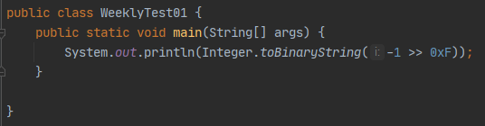
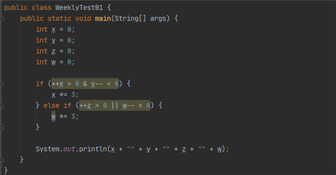
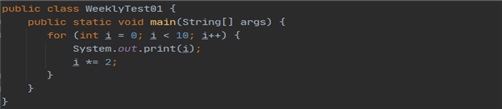

# Weekly Test #1

### Q1. 다음 중 Oracle JDK와 Open JDK에 대한 설명으로 옳지 않은 것을 고르시오. * `답 : 2번`
1. Open JDK는 오픈소스로 무료 제공되는 Java 개발 플랫폼이다.
2. JRE에는 자바 가상 머신(JVM)과 개발 도구(Development Tool)가 포함되어 있다.
3. Oracle JDK는 비상업적인 용도의 사용은 제한되어 있지 않다.
4. Oracle JDK와 Open JDK 외에도 Amazon Correto, Twitter-JDK 등 다양한 JDK 구현체들이 공개되어 있다.

* JRE에는 자바 가상 머신(JVM)과 Library Classes 가 포함되어있고,
* JDK에는 JRE와 개발 도구(Development Tool)이 포함되어 있다.

### Q2. 다음 중 권장되는 변수 명명법으로 옳지 않은 것을 고르시오. * `답 : 1번`

1. 변수명은 최대한 짧게 명명하여 코드 영역이 메모리를 최소로 차지하는 것이 좋다.
2. 클래스, 인터페이스 등은 보통 PascalCase로 이름을 명명한다.
3. 변수와 메소드의 이름은 camelCase로 쓰는 것을 권장한다.
4. final 등의 상수 변수는 UPPER_CASE로 쓰는 것이 일반적이다.

* 변수명의 길이는 메모리 영역과 상관이 없기 때문에 길이가 상관없다.

### Q3. 다음 중 자료형에 대한 설명이 옳게 연결된 것은? * `답: 3번`

1. char 자료형과 short 자료형은 동일한 정수 범위를 표현한다.
2. 논리형 변수인 boolean은 true와 false만을 표기하므로 1bit로 구성된다.
3. 실수 자료형은 정수 자료형보다 표현할 수 있는 값의 범위가 넓다.
4. 모든 정수 자료형은 사칙연산 시 int로 변형된 후에 연산이 이루어진다.

* char 자료형은 0~2^7-1 까지이고 short 자료형은 –2^15 ~ 2^15-1까지이다.
* boolean은 true와 false만을 표기하는 것은 맞지만 1byte로  구성된다.
* 실수형 자료형은 정수형 자로형보다 표현 범위가 넓은 것은 맞다.
* 모든 정수형 자료형이 사칙연산 시 int로 변형된 후 연산이 이루어지는 것은 아니다.

### Q4. 다음 코드를 실행한 결과 콘솔에 출력되는 내용을 적으시오. *`답 : 11111111111111111111111111111111 `

* -1은 원래 11111111111111111111111111인데 왼쪽으로 시프트연산 해도 똑같은 값이 
나온다.

### Q5. 다음 중 명시적 형변환이 불필요한 경우를 모두 고르시오. *`답 : int -> long, float -> double`

1. int -> long
2. float -> double
3. byte -> char
4. char -> byte

* 명시적 형변환은 작은 자료형이 큰 자료형으로 변환될 때 사용하는 것으로
여기서는 위의 두 개가 정답이다.
* byte 가 1바이트고, Char이 크기가 2바이트인데, 바이트크기만보면 업캐스팅이맞는데
* byte는 음수를포함하고있는데 char의 표현범위는 양수만이라서byte의 음수를 char이표현을못해서 다운 캐스팅을 해줘야 한다.

### Q6. 아래 코드의 실행 결과를 쓰시오. *`정답 1-110`

* ++x > 0 & y--　＜0　에서 x는 증가해서 1이되고 y는감소해서 –1이 된다. 
* & 연산은 둘다 참일 때 조건문이 실행되는데 참이아니여서 실행이 안됨
* 그리고 밑에 조건식은 앞에 연산이 참일 때 뒤에 연산은 실행하지 않음
* 그래서 z는 증가해서 1이되고 w는 연산이되지 않아 0이됨.

### Q7. switch ~ case 문에 대한 설명으로 옳은 것을 고르시오. * `답: 4번`
1. 특별한 경우에 if ~ else문 대신 간결하게 사용할 수 있다.
2. switch의 조건문에는 반드시 boolean이 사용되어야 한다.
3. case 문 사이에는 continue 문을 통해 흐름을 제어해야 한다.
4. switch ~ case 문에서는 fall-through를 이용해 여러 case를 병합할 수 있다.

* 특별한 경우에만 사용될 수 있는 것이아니라 if~else문과 switch~case문은 서로 대신해서 사용할 수 있다.
* 조건문에는 반드시 boolean타입만 사용해야 하는게 아니라 정수형, 문자형, 실수형 타입등 다른 타입으로도 사용이 가능하다.
* case 문 사이에 흐름을 제어하는 것은 break 문이다.

### Q8. 아래 코드를 실행한 결과 콘솔에 출력되는 내용을 입력하시오. `답 : 0137`

* I의 값이 2가 곱해서 증가하므로 0부터 홀수 숫자만 출력됨

### Q9. 배열에 대한 설명으로 옳지 않은 것은? * `답 : 2번`
1. 배열은 값을 메모리에 연속적으로 보유하고 있다.
2. 배열은 반드시 생성할 때에 값이 초기화 되어야 한다.
3. 한번 생성한 배열은 크기를 변경할 수 없다.
4. 하나의 배열에는 단 하나의 자료형만을 저장할 수 있다.

* 배열은 선언만 할 수도 있고, 선언한 후에 초기화를 해줘도 된다.

### Q10. 다차원 배열을 사용할 때 주의해야 할 점으로 옳지 않은 것은? * `답 : 3번`
다차원 배열은 배열을 요소 값으로 가지는 배열을 말한다.
2차원 배열은 수학적으로 행렬을 의미하는 것은 아니기 때문에, 각 행이 같은 길이의 열을 가지지 않아도 된다.
3차원 이상의 배열은 메모리에 값이 연속적으로 존재하지 않을 수도 있다.
다차원 배열은 배열의 요소에 접근할 때 더 높은 차원의 인덱스를 먼저 입력한다.

* 배열은 메모리에 값이 연속적으로 존재한다.