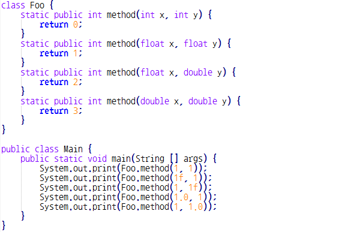
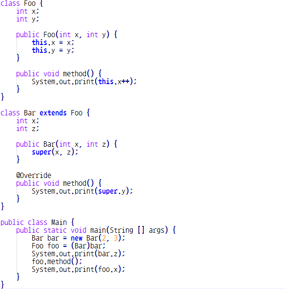

# WeeklyTest #2 오답 정리 및 복습

### Q1. 다음 중 객체지향 프로그래밍에 대한 설명으로 옳지 않은 것은? * `답 : 2번`
1. Java는 객체지향 프로그래밍 언어이다.
2. Java로 작성한 소스 코드는 항상 객체지향적이다. 
3. 객체지향적 프로그래밍의 핵심적인 요소는 추상화, 다형성, 상속, 캡슐화이다.
4. 객체 지향적으로 작성한 코드는 알아보기 쉽고, 유지 보수에 유리하다.

* Java로 작성한 소스 코드는 항상 객체지향적일 수가 없고, 우리가 한 코드에서도 그렇지 않은 코드들이 많았다. 

### Q2. 클래스 변수와 인스턴스 변수에 대한 설명으로 옳지 않은 것을 고르시오. * `답 : 2 번`

1. Blank final 인스턴스 변수는 생성자에서 값을 결정한다.
2. 인스턴스 변수의 초기화는 정적 초기화 블록에서 이루어질 수 있다. 
3. 클래스 변수는 인스턴스를 이용해 접근 가능하나, 일반적으로 클래스명을 이용해 접근하기를 권장한다.
4. 클래스 변수는 생성자에서 값을 변경할 수 있다.

* 인스턴스 변수는 정적 초기화 블록에서 이루어질 수 없다. 정적 초기화 블록은 인스턴스 변수가 생성되기 전에 만들어지기 때문이다.
 생각해봐도 인스턴스 변수는 객체의 변수를 의미하므로, 클래스 초기화 블록에서 불가능

 
### Q3. 다음 중 자료형에 대한 설명으로 옳지 않은 것은? * `답 : 3번`
1. Primitive type은 자료의 값이 메모리에 직접 저장된다.
2. Reference type은 항상 힙 영역에 객체를 생성하고, 이를 참조하는 참조값을 저장한다.
3. String은 클래스이지만, 예외적으로 Primitive type이다.
4. Reference type의 변수를 ==를 이용해 비교하면 참조값을 비교한다.

* String은 클래스이고, Reference type이다.

### Q4. 다음 코드를 실행한 결과 콘솔에 출력되는 내용을 적으시오. * `답 : 01132`

* 범위가 작은 자료형은 큰 자료형으로 업캐스팅 되서 들어갈 수 있다 이것 만 주의하면 쉽게 풀이 가능

### Q5. 부모 클래스로부터 상속하여 자식 클래스를 생성할 때 사용하는 키워드를 적으시오. *
`답 : extends`

### Q6. 클래스를 import하는 방법에 대한 설명으로 옳지 않은 것을 고르시오. * `답 : 1번`
1. 현재 작성중인 소스 코드와 다른 패키지에 속한 클래스는 예외없이 import를 해 주어야 사용할 수 있다.
2. 정적 import를 이용하면 정적 메소드나 정적 변수를 클래스명 없이 사용할 수 있다.
3. *를 이용하면 패키지에 속한 모든 클래스를 import할 수 있으나, 서브패키지에 속한 클래스는 import되지 않는다.
4. public 클래스는 반드시 소스코드의 파일 이름과 동일해야 한다.

* 예외가 있다 java.lang은예외이다. string도 예외로 import 하지 않아도 사용이 가능하다.

 
### Q7. 접근 제어자에 대한 설명으로 옳은 것을 모두 고르시오. * `답 : 3,4번`
1. 클래스는 protected 제어자를 사용할 수 있다.
2. default 제어자는 package 키워드로 명시하여 표현 수 있다. 
3. private 변수 또는 protected 변수는 getter와 setter를 이용하여 접근할 수 있다. 
4. default 제어자는 동일한 패키지 내에서 접근이 가능한 제어자이다.

* 클래스는 public, default 제어자만 사용할 수 있다.
* default 제어자는 제어자를 사용하지 않게만 사용할 수 있다.

### Q8. 아래 코드를 실행한 결과 콘솔에 출력되는 내용을 입력하시오. `답 : 032`

* bar.z 는 그대로 z가 출력이 되는데 초기화가 이루어지지 않아 0이 출력된다.
* foo.method()는 virtual method call 로 재정의된 method() 출력
* foo.x는 2가 출력된다.

### Q9. 메소드의 오버로딩에 대한 설명으로 옳은 것을 고르시오. * `답 : 2번`
1. 자식 클래스에서 메소드를 오버로드할 경우, 부모 클래스로 캐스팅된 객체에서도 사용할 수 있다.
2. 여러 개의 파라미터 생성자를 오버로딩할 수 있다.
3. 오버로딩된 메소드는 함수명과 리턴 타입이 반드시 동일해야 한다.
4. 정적 메소드을 오버로딩하려면, 함수명을 달리해야 한다.

* 부모클래스 변수접근이 제한됨 메소드는 Virtual Method가 되서 이름만 있는 것이 된다.
* 정적 메소드는 오버로딩이 가능하다므로 함수명을 달리안해도 된다.
* 반드시 함수명과 리턴타입이 동일하지 않아도 된다.

### Q10. 클래스의 관계에 관한 설명으로 옳지 않은 것을 고르시오. * `답 : 1번`
1. 생성자에서 super 키워드는 단 한번만 사용할 수 있다.
2. 상속 관계를 'IS-A' 관계, 포함 관계를 'HAS-A' 관계라고도 한다.
3. 자식 클래스의 객체를 생성할 때, 부모 클래스의 객체가 먼저 만들어진다.
4. 자식 클래스에서 부모 클래스의 메소드를 재정의하는 것을 오버라이딩이라 한다.

* super키워드는 여러번 사용할 수 있음 단, super() 호출은 첫 줄에 한 번만 사용가능
ex) super.x , super.y, super.z
