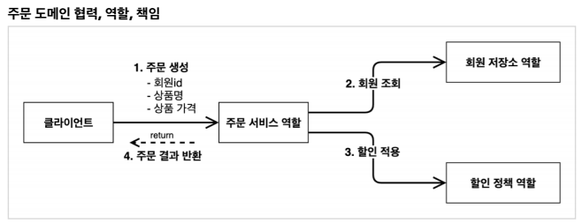
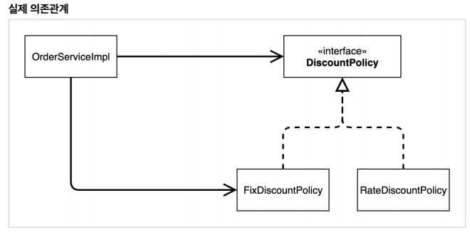

# 오늘의 공부 계획
* 2시반까지 인성 모의 면접 준비를 하고, 3시까지 모의 면접을 진행
* 3시 ~ 7시 30분까지 인프런 스프링 강의 3개 이상 보기
* 8시 ~ 10시까지 알고리즘 3문제 풀기
 
# 오늘 공부한 내용
* 2시반까지 면접 준비하고, 3시까지 면접 진행.
* 인프런 스프링 강의 오늘은 주문 할인 도메인 설계, 개발, 테스트와 새로운 할인 정책을 넣어서
객체를 바꿔 끼우는 것에 대한 강의를 보았다.
* 알고리즘 2문제 정도 풀었다.
# 오늘 공부 하면서 배운 점 및 생각
* 면접을 준비하고 진행했는데... 망함... 내가 무슨 말을 했는지, 질문이 뭐였는지도 모르겠다 
정말 어렵다.. 어떤 답안이 좋은 답안일까 모르겠다 실제 회사 면접때는 잘 할 수 있을까ㅜㅜ 
얼마나 준비를 해야하는 거야..
* 점점 알고리즘 문제들을 못 풀겠다. 어떻게 하냐! 못 푸는건 일단 답을 보고 나중에 다시 풀어보는 방식으로 해야하나..
낮은 레벨의 문제도 못 푸니 스스로한테 짜증이 난다.

## 인프런 스프링 강의 정리
### 주문과 할인 도메인 설계



1. 클라이언트(main, 컨트롤러 등)는 주문 서비스에 주문 생성을 요청
2. 할인을 위해서 회원등급이 필요하니깐 주문 서비스는 회원 저장소에서 회원을 조회
3. 조회한 등급에 따라 할인여부를 할인 정책에 위임한다.
4. 할인 결과를 포함한 주문 결과를 클라이언트에게 반환한다.
- 간단하게 하기 위해서 상품 모델을 안만들고 예제를 단순하게 하기 데이터만 넘기게 만들었다!
- 실제로는 주문 데이터를 DB에 저장하지만 예제가 복잡해 질 수 있어서 생략하고 단순 주문 결과만 반환!

클래스 다이어그램과 다르게 객체 다이어그램은 NEW해서 띄워서 동적으로 객체들의 연관관계가 맺어지는 그림이다!

### 주문과 할인 도메인 개발

할인정책, 주문에 대한 패키지를 따로따로 만들어서 구현한다!

- order 패키지 - Order , OrderService, OrderServiceImpl
- discountpolicy패키지 - discountpolicy, Fixdiscountpolicy

#### Order

- itemPrice와 할인정책으로 정해진 금액을 받을 discountPrice를 각각 선언한다.
- 상품가격과 할인된 금액을 계산하는 메소드를 넣어준다!

```
package hello.core.order;

public class Order {

    private Long memberId;
    private String itemName;
    private int itemPrice;
    private int discountPrice; // 이것도 따로 써줘야 한다.

    public Order(Long memberId, String itemName, int itemPrice, int discountPrice) {
        this.memberId = memberId;
        this.itemName = itemName;
        this.itemPrice = itemPrice;
        this.discountPrice = discountPrice;
    }

    public int calculatePrice(){
        return itemPrice - discountPrice;
    }

    public Long getMemberId() {
        return memberId;
    }

    public void setMemberId(Long memberId) {
        this.memberId = memberId;
    }

    public String getItemName() {
        return itemName;
    }

    public void setItemName(String itemName) {
        this.itemName = itemName;
    }

    public int getItemPrice() {
        return itemPrice;
    }

    public void setItemPrice(int itemPrice) {
        this.itemPrice = itemPrice;
    }

    public int getDiscountPrice() {
        return discountPrice;
    }

    public void setDiscountPrice(int discountPrice) {
        this.discountPrice = discountPrice;
    }

    @Override
    public String toString() {
        return "Order{" +
                "memberId=" + memberId +
                ", itemName='" + itemName + '\'' +
                ", itemPrice=" + itemPrice +
                ", discountPrice=" + discountPrice +
                '}';
    }
}

```

#### OrderService

- 주문 생성에 대한 메소드만 정의해 줬다.

```
package hello.core.order;

public interface OrderService {
    Order createOrder(Long memberId, String itemName, int itemPrice);

}

```

#### OrderServiceImpl

- createOrder  하나의 메소드에서 회원 조회를 했다가, 할인정책을 적용하는 것까지 한번에 처리한다!
- int discountPrice = discountPolicy.discount(findMember, itemPrice);
    - 이게 설계가 잘된것 orderservice는 할인정책은 모르니깐 discountPolicy한테 할인 정책은 너가 알아서 해줘 하고 던져주면 알아서 할인정책에 맞게 할인된 금액을 반환해주게 되어있어서 SRP를 잘 지킨 설계가 된다!!!
    - GRADE만 넘길까 Member 자체를 넘길까를 고민해서 맞게 파라미터로 넣어주면 된다.  여기선 확장성있게 member로 넣어줬다.

```
package hello.core.order;

import hello.core.discount.DiscountPolicy;
import hello.core.discount.FixDiscountPolicy;
import hello.core.member.Member;
import hello.core.member.MemberRepository;
import hello.core.member.MemoryMemberRepository;

public class OrderServiceImpl implements OrderService{

    private MemberRepository memberRepository = new MemoryMemberRepository();
    private DiscountPolicy discountPolicy = new FixDiscountPolicy();

    @Override
    public Order createOrder(Long memberId, String itemName, int itemPrice) { // 하나의 메소드에서 회원 조회를 했다가, 할인정책을 적용하는 것까지 한번에 처리한다!
        Member findMember = memberRepository.findById(memberId);
        int discountPrice = discountPolicy.discount(findMember, itemPrice);

        Order returnOrder = new Order(findMember.getId(), itemName, itemPrice, discountPrice);
        return returnOrder;
    }
}

```

#### FixDiscountPolicy

- Grade에 따라 할인 금액을 이 자체에서 로직을 처리하는게 포인트!

```
package hello.core.discount;

import hello.core.member.Grade;
import hello.core.member.Member;

public class FixDiscountPolicy implements DiscountPolicy{
    private int discountFixAmount = 1000;
    @Override
    public int discount(Member member, int price) {
        if (member.getGrade() == Grade.VIP) {
            return discountFixAmount;
        } else {
            return 0;
        }
    }
}
```

### 알게 된 점!
* Emum은 비교할 때 `==` 을 사용하면 된다!!

시나리오 기획자가 나타나서 새로운 할인정책을 추가해 달라고 요청한다!

### RateDisCountPolicy

```
package hello.core.discount;

import hello.core.member.Grade;
import hello.core.member.Member;

public class RateDiscountPolicy implements DiscountPolicy{

    private int discountPercent = 10;

    @Override
    public int discount(Member member, int price) { // 할인된 금액!!!!!!할인되어진 총 금액이 아니라!!
        if (member.getGrade() == Grade.VIP) {
            return price * discountPercent / 100; // 이 로직이 맞는지 확인해봐야 함!
        } else {
            return 0;
        }
    }
}
```

### OrderServiceImpl

- private DiscountPolicy discountPolicy = new RateDiscountPolicy();
    - 할인 정책을 바꾸려면 이렇게 구현객체를 클라이언트 클래스에서 바꿔줘야 했다..!

```

public class OrderServiceImpl implements OrderService {

    private MemberRepository memberRepository = new MemoryMemberRepository();
    private DiscountPolicy discountPolicy = new RateDiscountPolicy();
//    private DiscountPolicy discountPolicy = new FixDiscountPolicy();

    @Override
    public Order createOrder(Long memberId, String itemName, int itemPrice) { // 하나의 메소드에서 회원 조회를 했다가, 할인정책을 적용하는 것까지 한번에 처리한다!
        Member findMember = memberRepository.findById(memberId);
        int discountPrice = discountPolicy.discount(findMember, itemPrice);

        Order returnOrder = new Order(findMember.getId(), itemName, itemPrice, discountPrice);
        return returnOrder;
    }
}
```

### 새로운 할인 정책을 적용하면서 문제점

- 역할과 구현의을 충실하게 분리했고, 다형성도 활용했다.
- 하지만 OCP, DIP같은 좋은 객체 지향 설계 원칙에 대해서는 준수하지 못했다.
    - 주문 서비스 클라이언트는 DIP를 준수한 것 처럼 보이지만, DiscountPolicy 인터페이스와 그 구현 객체들을 new로 주입받기 때문에 구현체도 함께 의존하고 있는 것 과 같다.

    

    - OCP도 할인 정책을 변경하려면 클라이언트인 OrderServiceImpl에서 discountPolicy의 객체를 변경해줘야하는 코드 변경이 생긴다.

위의 문제들 때문에 클라이언트는 인터페이스에만 의존하도록 구현되어 있어야 한다.

```java
private DiscountPolicy discountPolicy;
```

- 이 상태로만 쓰면 NullPointerException이 발생한다. 선언된 클래스에 객체가 주입이 안되었으니.. 그래서 객체를 대신 생성해서 주입해줄 수 있는게 필요하다! 다음시간에 계속~

### 참고!

테스트는 성공 테스트도 중요하지만 실패 테스트도 만들어봐야 한다!

돈에 대한 테스트는 엄청 어려움.. 그래서 테스트들이 엄청 많다.

NullPointerException - null에다가 `.` 을 찍으니 에러가 난다. 객체들이 null인 상태인데 거기에 그 객체의 메소드를 호출하기 위해 `객체.메소드()` 를 하니 에러가 나는 것!