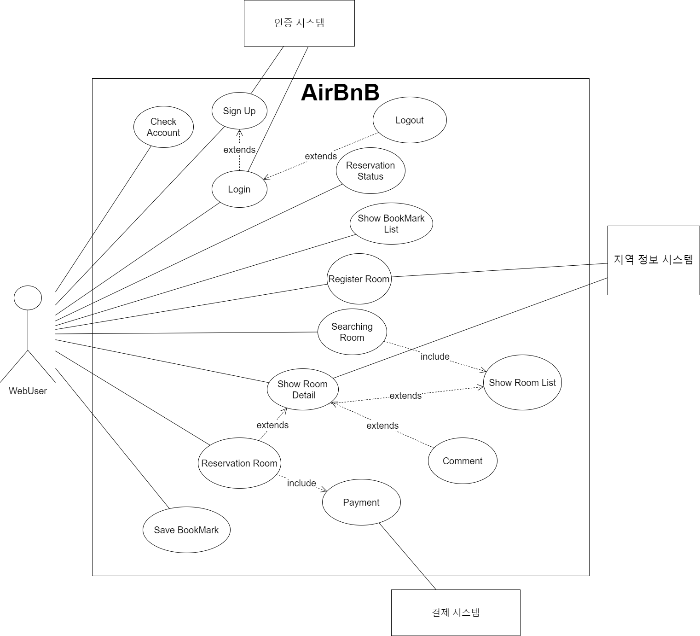
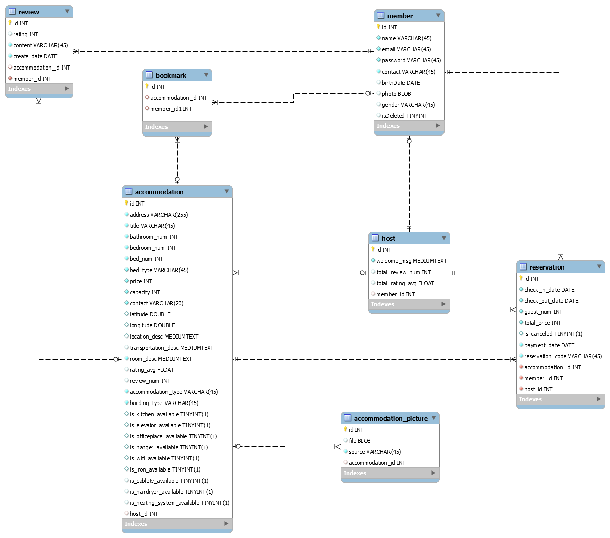

# 최종 프로젝트
## 진행 내용
- DB설계 내용 고치면서 ERD 1 차 설계

## 회의 내용
- 예약 - 수정, 취소 둘 다 o
- 회원 - 탈퇴 o, 정보 수정 o
- 저장하기 - 카드 리스트로 바로 만들어지게
- 최근 조회 FE에서 뺄 듯
- 후기 개수  숙박 설명만 받아오기 나머지(응답률 등)- default
- 최소 숙박 x, 최대 숙박 x, 몇개월 이후 이런 것들 제거
- 필터 추가하기 제거, 숙소 유형(그대로 ), 요금만
    - 건물 유형(아파트, 주택, 별채, 부티크 호텔)
- 휴대전화 번호 인증 처리x
- 슈퍼호스트 빼기
- 위도와 경도를 FE에서 보내주면 위도 경도에 따라서 다시 화면 렌더링?
    - 숙소에 위도 경도를 넣어놨으니깐 → 지도의 모서리 위도 경도를 보내주시면 이 안에 있는 리스트들 보여주면 됨

## 우리조 중간 발표 피드백
- cdn? 문자 인증 내용 받아서 처리하는 부분 채워야 함
- 서버단에서 결제를 일으킨다.. 실제 결제와 통신은 서버에서 일어남 2~3번을 왔다갔따해서 굉장히 어려움... 시간이 많이 걸림. 계정정보 이메일로 하고 시간이 생기면 sns를 추가하는게 좋을 것같음
- 휴대폰 로그인 더미스타일로 로그인했다 치고 하는게 좋다.
- 이미지는 s3로 url로 저장하는게 더 좋다. password 암호화, api 대화가 필요함..
- 인터페이스, 기능들 협의가 필요하다.
- 발표한내용도 처음얘기하는 것처럼 말해야한다 각 목표를 확실히 정하고 배분해서 해야한다. 핵심기능부터 처리해나가야한다. api 문서화 필요
_ 결제, 외부 API를 받아오는 일들이 생각보다 어렵고 시간이 오래 걸릴 수 있기 때문에
이런 부분들은 과감하게 쳐내고 핵심 기능에 대해서만 집중할 수 있도록 설계하는게 좋다.
### 최종발표 때 필요한 내용

* 어떤 부분까지 개발이 되어야할지 계획되어야한다 발표자료 준비해야함

### 수정할 내용

- 결제 뺌
- OAuth 구글, 이메일으로만 로그인하도록 진행
- 휴대폰 인증 뺌
- aws s3  구성
- host 등록하기 부분 뺌

## 내일 할 내용
- api 회의, 문서 작성
- api 서버 올리기
- DB 설계 내용 전체 회의

## 오늘의 에러 사항
* 프로젝트를 여러 사람이 접근해서 사용할 수 있도록, 서버 배포를 진행해야 하는데 이부분을
놓치고 있다가 끝날쯤 이 이야기가 나와서, 아직 배워보지 못하고, 개념조차 없는 내용이지만
빠르게 세팅을 해놔야하는 사항이 생겼다.