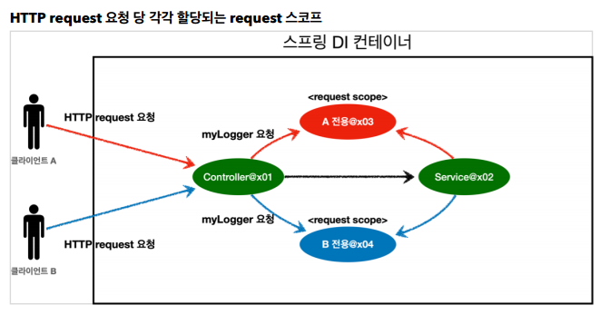

# 오늘 해야 할 일
* 스프링 강의 3개 들으면서 내용 정리 및 이전 내욕 복습
* 프리 다이빙 프로젝트 DB설계 회의
* 알고리즘 문제 풀고, 내용 정리

# 오늘 진행한 내용 요약 및 느낀 점
* 스프링 강의 싱글톤 빈과 함께 사용할 때 프로토타입이 하나의 객체로만 사용되어지는 문제점을
해결하는 방법으로 Provider라는 방법을 배웠다. 
   * Provider는 스프링에서 제공하는 것과 자바 표준에서 제공하는 것이 있는데 보통의 경우 스프링에서 제공하는 것을 사용하면 될 것 같고, 다른 컨테이너에서
   사용하는 경우 등이 생기면 자바 표준 것을 사용하면 될 것 같다!
   * 웹 스코프 - Request에 대해서도 배웠는데 이것은 클라이언트의 요청이 있을 때 객체가 생성되는 것이다.
   그래서 요청이 수행되고 응답으로 나가기전까지 존재하고 응답으로 나가게 되면 파괴되서 종료 메소드 호출이 된다.
   
* 프리 다이빙 프로젝트 이슈를 보면서 DB에 필요한 부분들을 추가하고, 추가된 사항들 정리했다.

* 알고리즘 강의에서 DP관련해서 n*n 배열에 데이터들이 주어졌을 때 특정 지점까지 최소합을 구하는
문제를 풀이해주는 강의를 보고, 다시 구현해봤는데 나중에 혼자서 다시 구현해보고 혼자서 완벽하게 구현하면
그때 풀이를 작성할 생각이다.
 
* 알고리즘 문제
    * [방번호](https://www.acmicpc.net/problem/1475)
        * 그래도 고민고민 하니깐 결국 구현방법이 생각이 나긴 하는구나... 어제 밤에 고민하다가 어떻게 풀어야 하지
        고민하다가 못 풀고 잤는데 오늘 고민하다가 방법이 생각났다 조금은 늘은 거겠지..?
        100%에서 계속 틀렸는데 이유가 뭔가 봤더니 input이 0일 때 1이 출력이 되어야 한다. 방번호가 0일 수도 있으니깐
        이점을 고려하지 못하고 있다가 찾아서 해결했다!
        
    * [날짜계산](https://www.acmicpc.net/problem/1476)
        * 어떻게 푸는거야 하다가.. 쉽게 생각하고 반복문으로 해보자해서 구현해 봤는데 정답이였다...
        문제를 너무 어렵게 생각할 필요 없이 쉽게 볼 필요도 있는 것 같다.
        
    * 알고리즘 다른 문제들도 풀려고 해봤는데 혼자서 구현을 못했다. 그래서 블로그를 참고해서 구현 방법을 공부하고,
    나중에 다시 풀어볼 예정이다!
        * [체스판다시칠하기](https://www.acmicpc.net/problem/1018)
            * 이 문제는 다른 사람의 구현을 보고 내 스스로 생각해서 이 문제를 풀지 못했을 것 같다라는
            생각이 확실하게 들었다.. 참고하면서 배워서 비슷한 유형에서 활용하도록 연습해야 할 것 같다.   
        * [요세푸스문제](https://www.acmicpc.net/problem/1158)
             * 이 문제는 완전히 이해를 했다고 생각을 하는데 구현에서 막힌다.. 이해를 못한 건가 그래서 욕심이나서
             이 문제는 다른 사람의 구현을 보지 않고 혼자서 끝까지 풀어볼 생각이다.
        * [영화감독 숌](https://www.acmicpc.net/problem/1436)
        * [약수](https://www.acmicpc.net/problem/1037)
            * 위 두 문제는 정말 정말 어이없을 정도로 간단한 문제들이였어서 화가났다. 이런 문제들을 왜
            스스로 못 풀었을까 이 글을 쓰면서도 짜증이난다... 
        
    

# 스프링 강의 내용 정리
## 프로토타입 스코프 - 싱글톤 빈과 함께 사용시  Provider로 문제 해결
* 싱글톤 빈과 프로토 타입 빈을 함께 사용할 때, 어떻게 하면 사용할 때마다 항상 새로운 프로토타입 빈을 생성할 수 있을까

```java
public class PrototypeProviderTest {
 @Test
 void providerTest() {
 AnnotationConfigApplicationContext ac = new
AnnotationConfigApplicationContext(ClientBean.class, PrototypeBean.class);
 ClientBean clientBean1 = ac.getBean(ClientBean.class);
 int count1 = clientBean1.logic();
 assertThat(count1).isEqualTo(1);
 ClientBean clientBean2 = ac.getBean(ClientBean.class);
 int count2 = clientBean2.logic();
 assertThat(count2).isEqualTo(1);
 }
 static class ClientBean {
 @Autowired
 private ApplicationContext ac;
 public int logic() {
 PrototypeBean prototypeBean = ac.getBean(PrototypeBean.class);
 prototypeBean.addCount();
 int count = prototypeBean.getCount();
 return count;
 }
 } @Scope("prototype")
 static class PrototypeBean {
 private int count = 0;
 public void addCount() {
 count++;
 }
 public int getCount() {
 return count;
 }
 @PostConstruct
 public void init() {
 System.out.println("PrototypeBean.init " + this);
 }
 @PreDestroy
 public void destroy() {
 System.out.println("PrototypeBean.destroy");
 }
 }
}
```

- 실행해보면 ac.getBean() 을 통해서 항상 새로운 프로토타입 빈이 생성되는 것을 확인할 수 있다.
- 의존관계를 외부에서 주입(DI) 받는게 아니라 이렇게 직접 필요한 의존관계를 찾는 것을 Dependency
Lookup (DL) 의존관계 조회(탐색) 이라한다.
- 그런데 이렇게 스프링의 애플리케이션 컨텍스트 전체를 주입받게 되면, 스프링 컨테이너에 종속적인 코드가
되고, 단위 테스트도 어려워진다.
- 지금 필요한 기능은 지정한 프로토타입 빈을 컨테이너에서 대신 찾아주는 딱! DL 정도의 기능만 제공하는
무언가가 있으면 된다

### ObjectFactory, ObjectProvider

- 지정한 빈을 컨테이너에서 대신 찾아주는 DL 서비스를 제공하는 것이 바로 ObjectProvider 이다. 참고로
과거에는 ObjectFactory 가 있었는데, 여기에 편의 기능을 추가해서 ObjectProvider 가 만들어졌다.

```java
@Autowired
private ObjectProvider<PrototypeBean> prototypeBeanProvider;
public int logic() {
 PrototypeBean prototypeBean = prototypeBeanProvider.getObject();
 prototypeBean.addCount();
 int count = prototypeBean.getCount();
 return count;
}
```

- 실행해보면 prototypeBeanProvider.getObject() 을 통해서 항상 새로운 프로토타입 빈이 생성되는 것을 확인할 수 있다.
- ObjectProvider 의 getObject() 를 호출하면 내부에서는 스프링 컨테이너를 통해 해당 빈을 찾아서 반환한다. (DL)
- 스프링이 제공하는 기능을 사용하지만, 기능이 단순하므로 단위테스트를 만들거나 mock 코드를 만들기는
훨씬 쉬워진다.
- ObjectProvider 는 지금 딱 필요한 DL 정도의 기능만 제공한다.

### 특징

- ObjectFactory: 기능이 단순, 별도의 라이브러리 필요 없음, 스프링에 의존
- ObjectProvider: ObjectFactory 상속, 옵션, 스트림 처리등 편의 기능이 많고, 별도의 라이브러리 필요 없음, 스프링에 의존

### JSR-330 Provider

- 마지막 방법은 javax.inject.Provider 라는 JSR-330 자바 표준을 사용하는 방법이다.
- 이 방법을 사용하려면 javax.inject:javax.inject:1 라이브러리를 gradle에 추가해야 한다.

```java
@Autowired
private Provider<PrototypeBean> provider;
public int logic() {
 PrototypeBean prototypeBean = provider.get();
 prototypeBean.addCount();
 int count = prototypeBean.getCount();
 return count;
}
```

- 실행해보면 provider.get() 을 통해서 항상 새로운 프로토타입 빈이 생성되는 것을 확인할 수 있다.
- provider 의 get() 을 호출하면 내부에서는 스프링 컨테이너를 통해 해당 빈을 찾아서 반환한다. (DL)
- 자바 표준이고, 기능이 단순하므로 단위테스트를 만들거나 mock 코드를 만들기는 훨씬 쉬워진다.
- Provider 는 지금 딱 필요한 DL 정도의 기능만 제공한다.

### 특징

- get() 메서드 하나로 기능이 매우 단순하다.
- 별도의 라이브러리가 필요하다.
- 자바 표준이므로 스프링이 아닌 다른 컨테이너에서도 사용할 수 있다.

### 정리

- 그러면 프로토타입 빈을 언제 사용할까? 매번 사용할 때 마다 의존관계 주입이 완료된 새로운 객체가 필요하
면 사용하면 된다. 그런데 실무에서 웹 애플리케이션을 개발해보면, 싱글톤 빈으로 대부분의 문제를 해결할
수 있기 때문에 프로토타입 빈을 직접적으로 사용하는 일은 매우 드물다.
- ObjectProvider , JSR330 Provider 등은 프로토타입 뿐만 아니라 DL이 필요한 경우는 언제든지 사용 할 수 있다.

> 참고: 스프링이 제공하는 메서드에 @Lookup 애노테이션을 사용하는 방법도 있지만, 이전 방법들로 충분하고, 고려해야할 내용도 많아서 생략하겠다.

> 참고: 실무에서 자바 표준인 JSR-330 Provider를 사용할 것인지, 아니면 스프링이 제공하는
ObjectProvider를 사용할 것인지 고민이 될 것이다. ObjectProvider는 DL을 위한 편의 기능을 많이 제공해주고 스프링 외에 별도의 의존관계 추가가 필요 없기 때문에 편리하다. 만약(정말 그럴일은 거의 없겠지만) 코드를 스프링이 아닌 다른 컨테이너에서도 사용할 수 있어야 한다면 JSR-330 Provider를 사용해야한다.

> 스프링을 사용하다 보면 이 기능 뿐만 아니라 다른 기능들도 자바 표준과 스프링이 제공하는 기능이 겹칠때가 많이 있다. 대부분 스프링이 더 다양하고 편리한 기능을 제공해주기 때문에, 특별히 다른 컨테이너를 사용할 일이 없다면, 스프링이 제공하는 기능을 사용하면 된다

# 웹 스코프

- 웹 스코프의 특징웹 스코프는 웹 환경에서만 동작한다.
- 웹 스코프는 프로토타입과 다르게 스프링이 해당 스코프의 종료시점까지 관리한다. 따라서 종료 메서드가
호출된다.
- 웹 스코프 종류
    - request: HTTP 요청 하나가 들어오고 나갈 때 까지 유지되는 스코프, 각각의 HTTP 요청마다 별도의 빈
    인스턴스가 생성되고, 관리된다.
    - session: HTTP Session과 동일한 생명주기를 가지는 스코프
    - application: 서블릿 컨텍스트( ServletContext )와 동일한 생명주기를 가지는 스코프
    - websocket: 웹 소켓과 동일한 생명주기를 가지는 스코프



## Request Scope

> 참고: spring-boot-starter-web 라이브러리를 추가하면 스프링 부트는 내장 톰켓 서버를 활용해서 웹
서버와 스프링을 함께 실행시킨다.

> 참고: 스프링 부트는 웹 라이브러리가 없으면 우리가 지금까지 학습한
AnnotationConfigApplicationContext 을 기반으로 애플리케이션을 구동한다. 웹 라이브러리가 추가되면 웹과 관련된 추가 설정과 환경들이 필요하므로
AnnotationConfigServletWebServerApplicationContext 를 기반으로 애플리케이션을 구동한다.

- 동시에 여러 HTTP 요청이 오면 정확히 어떤 요청이 남긴 로그인지 구분하기 어렵다.
- 이럴때 사용하기 딱 좋은것이 바로 request 스코프이다.

다음과 같이 로그가 남도록 request 스코프를 활용해서 추가 기능을 개발해보자.

```java
[d06b992f...] request scope bean create
[d06b992f...][[http://localhost:8080/log-demo](http://localhost:8080/log-demo)] controller test[d06b992f...][[http://localhost:8080/log-demo](http://localhost:8080/log-demo)] service id = testId
[d06b992f...] request scope bean close
```

- 기대하는 공통 포멧: [UUID][requestURL] {message}
- UUID를 사용해서 HTTP 요청을 구분하자.
    - UUID - 세계에서 유일하도록 식별 가능한 ID
- requestURL 정보도 추가로 넣어서 어떤 URL을 요청해서 남은 로그인지 확인하자.

```java
@Component
@Scope(value = "request")
public class MyLogger {
 private String uuid;
 private String requestURL;
 public void setRequestURL(String requestURL) {
 this.requestURL = requestURL;
 }
 public void log(String message) {
 System.out.println("[" + uuid + "]" + "[" + requestURL + "] " +
message);
 }
 @PostConstruct
 public void init() { uuid = UUID.randomUUID().toString();
 System.out.println("[" + uuid + "] request scope bean create:" + this);
 }
 @PreDestroy
 public void close() {
 System.out.println("[" + uuid + "] request scope bean close:" + this);
 }
}
```

- 로그를 출력하기 위한 MyLogger 클래스이다.
- @Scope(value = "request") 를 사용해서 request 스코프로 지정했다. 이제 이 빈은 HTTP 요청 당 하나씩 생성되고, HTTP 요청이 끝나는 시점에 소멸된다.
- 이 빈이 생성되는 시점에 자동으로 @PostConstruct 초기화 메서드를 사용해서 uuid를 생성해서 저장해
둔다. 이 빈은 HTTP 요청 당 하나씩 생성되므로, uuid를 저장해두면 다른 HTTP 요청과 구분할 수 있다.
- 이 빈이 소멸되는 시점에 @PreDestroy 를 사용해서 종료 메시지를 남긴다.
- requestURL 은 이 빈이 생성되는 시점에는 알 수 없으므로, 외부에서 setter로 입력 받는다.

```java
@Controller
@RequiredArgsConstructor
public class LogDemoController {
 private final LogDemoService logDemoService; private final MyLogger myLogger;
 @RequestMapping("log-demo")
 @ResponseBody
 public String logDemo(HttpServletRequest request) {
 String requestURL = request.getRequestURL().toString();
 myLogger.setRequestURL(requestURL);
 myLogger.log("controller test");
 logDemoService.logic("testId");
 return "OK";
 }
}
```

- 로거가 잘 작동하는지 확인하는 테스트용 컨트롤러다.
여기서 HttpServletRequest를 통해서 요청 URL을 받았다.
- requestURL 값 [http://localhost:8080/log-demo](http://localhost:8080/log-demo) 이렇게 받은 requestURL 값을 myLogger에 저장해둔다.
- myLogger는 HTTP 요청 당 각각 구분되므로
다른 HTTP 요청 때문에 값이 섞이는 걱정은 하지 않아도 된다.
- 컨트롤러에서 controller test라는 로그를 남긴다.

> 참고: requestURL을 MyLogger에 저장하는 부분은 컨트롤러 보다는 공통 처리가 가능한 스프링 인터셉터나 서블릿 필터 같은 곳을 활용하는 것이 좋다.

```java
@Service
@RequiredArgsConstructorpublic class LogDemoService {
 private final MyLogger myLogger;
 public void logic(String id) {
 myLogger.log("service id = " + id);
 }
}
```

- 비즈니스 로직이 있는 서비스 계층에서도 로그를 출력
- 여기서 중요한점은 request scope를 사용하지 않고 파라미터로 이 모든 정보를 서비스 계층에 넘긴다면, 파라미터가 많아서 지저분해진다.
- 더 문제는 requestURL 같은 웹과 관련된 정보가 웹과 관련없는 서비스 계층까지 넘어가게 된다. 웹과 관련된 부분은 컨트롤러까지만 사용해야 한다. 서비스 계층은 웹 기술에 종속되지 않고, 가급적 순수하게 유지하는 것이 유지보수 관점에서 좋다.
- request scope의 MyLogger 덕분에 이런 부분을 파라미터로 넘기지 않고, MyLogger의 멤버변수에 저장해서 코드와 계층을 깔끔하게 유지할 수 있다.

### 기대하는 출력

```java
[d06b992f...] request scope bean create
[d06b992f...][[http://localhost:8080/log-demo](http://localhost:8080/log-demo)] controller test
[d06b992f...][[http://localhost:8080/log-demo](http://localhost:8080/log-demo)] service id = testId
[d06b992f...] request scope bean close
```

### 실제는 기대와 다르게 애플리케이션 실행 시점에 오류 발생

```java
Error creating bean with name 'myLogger': Scope 'request' is not active for the
current thread; consider defining a scoped proxy for this bean if you intend to
refer to it from a singleton;
```

- 스프링 애플리케이션을 실행 시키면 오류가 발생한다. 
스프링 애플리케이션을 실행하는 시점에 싱글톤 빈은 생성해서 주입이 가능하지만, request 스코프 빈은
아직 생성되지 않아서 Error가 뜨는 것이다. 이 빈은 실제 고객의 요청이 와야 생성할 수 있다!