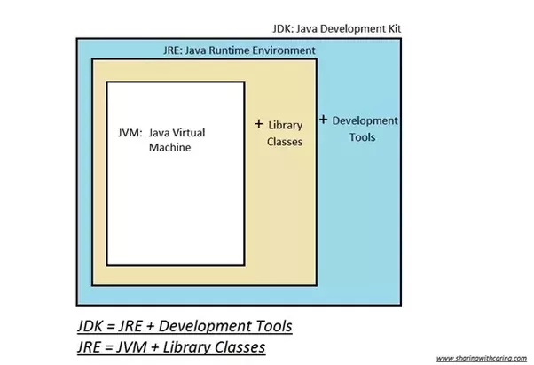

# 자바 개념 정리
## Java Editions
* Java SE – 개인용 개발 환경을 위한 Java
* Java EE – 기업용 개발 환경을 위한 Java
* Java ME – 임베디드 환경을 위한 Java 플랫폼

## 런 타임 과 컴파일 타임
### 런 타임  
 * 컴파일 과정을 마친 프로그램은 사용자에 의해 실행되어지며,
   이러한 응용프로그램이 동작되어지는 때를 런타임이라고 부른다.
### 컴파일 타임 
* 소스코드를 컴파일이라는 과정을 통해 기계어 코드로 변환되어 실행 가능한 프로그램이 되며,
  이러한 편집 과정을 컴파일 타임이라고 부른다.

## JDK

* JRE = JVM + Library Classes
* JDK = JRE + Development Tools

### Oracle JDK: 
* Oracle에서 제공하는 유료 Java 개발 플랫폼. 
* Oracle에서 지적 재산권을 보유한 일부 플러그인이 추가로 제공되며,Oracle로부터 사후 지원을 받을 수 있다. 
* 비상업적인 용도의 사용은 무료로 가능하나, 상업적 용도로 전환하거나 라이센스가 만료되면 
   더이상 Oracle JDK로 개발한 프로그램을 사용해서는 안된다.

### Open JDK: 
* 오픈소스로 제공되는 무료 Java 개발 플랫폼. Java6 시기에는 성능/안정성 측면에서 Oracle JDK와 차이가 있었으나,
  현재는 Oracle이 추가로 제공하는 일부 기능을 제외하면 차이가 없다.
* 그 외 Twitter-JDK, Zulu, Amazon Corretto, AdoptOpenJDK 등 특수 목적에 맞게 튜닝된 JDK 구현체가 서비스되고 있다.
* 참고: Java 언어 자체는 GPL 라이센스로, 무료로 개방되어 있다.

### Java Runtime Environment (JRE)
* Java로 작성된 프로그램을 실행하는 데에 필요한 환경
* Java로 작성된 프로그램은 JDK에 의해 bytecode로 컴파일되며, bytecode는 플랫폼에 종속되어 있지 않다. (Platform-independent)
* JDK를 이용하여 컴파일한 bytecode를 실행하는 Java Virtual Machine (JVM)로 구성되어 있다.
* 특정 머신에서 Java 프로그램을 실행하기 위해서는 해당 플랫폼에 맞는 JVM이 필요하다.

# 프로그래밍 이란?
* 프로그래밍 : 컴퓨터에게 일을 시키기 위해 프로그래밍 언어로 만든 명령어,집합인 프로그램을 만드는 일
* 컴파일: 프로그래밍 언어를 기계어로 바꾸어 주는일
* 컴파일러 : 기계어로 바꾸어 주는 프로그램, 자바를 설치하면 자바 컴파일러도 설치 됨.
````markdown
자바를 설치를 하면 자바 라이브러리가 설치가되고 구동되는 환경도 설치되고 자바컴파일러도 설치됨
C,C++는 메모리를 직접 핸들링하는 특징들을 가지고 있었고, 이로 인해 프로그램이 비정상적으로
다운되는 일이 있었다 이렇게 되면 가정제품이나, 임베디드 소프트웨어들이 불안정하게 되서
동작을 멈추게 될 수 있음 그래서 더 안전된 언어가 필요했고 그런게 자바다.
처음에 임베디드소프트웨어를 만드는데 활용되다가 점차 영역이 넓어짐
````

## 다른 언어와의 차이점
* 플랫폼에 독립적인 프로그래밍을 할 수 있음

## 자바 프로그램의 특징
* 객체지향 프로그램으로 유지보수와 확장성이 좋고, 안정적이다.
* 풍부한 라이브러리가 제공되고 오픈소스와 연동된다.

## 왜 객체지향 프로그램을 해야 하는가?
* 재사용성이 용이하다 , 코드관리하기가 쉽다, 유지보수 용이, 신뢰성 높은 프로그램

## 자바로 만들 수 있는 프로그램
* 웹 서버, 모바일 앱, 게임

