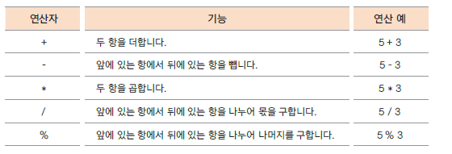

# Java 1-4
## 연산자(Operators)
### 연산자의 구성
 * 연산자 (Operator), 피연산자 (Operand) -> 연산식 (Expression)
 * 연산자 : 항을 이용하여 연산하는 기호
 * 피연산자(항) : 연산에 사용되는 값 
 
 
 
1. 사칙 연산자
     1. 정수형 사칙 연산
         ````markdown
          150 / 8 - 정수 나누기 -> 몫
          150 % 8 - modulus연산,나머지 값이 나옴
          ````
     2. 실수형 사칙 연산
          ````markdown
          10.5f + 12.3 - float, double 같이 연산되면 double로 변환 후 연산
          10.4-50 - 실수형, 정수형을 같이 연산하면 실수형으로 변환 후 연산
          5.2 / 1.2 - 몫이 아니고 실수 값으로 계산 됨
          5.2 % 1.2 - 실수 나눗셈도 modulus 연산으로 나머지 계산 가능 연산 이루어짐
          ````
     * 사칙연산의 주의사항
          ````markdown
            -가장 작은 값이됨 가장 큰 값에서 overflow 발생 시 가장 작은 값이 됨
            Integer.MAX_VALUE + 1 - //-2147483648 오버풀로우 발생.
            Integer.MAX_VALUE - //2147483647
            Integer.MAX_VALUE / 2 * 3 - //-1073741827 오버플로우 발생.
           
            int maxVal  = 0b01111111111111111111111111111; 
            //b다음에 0이면 양수 1이면 음수 32비트
            int maxVal1 = 0b10000000000000000000000000001; //2의 보수
            int minVal2 = 0b10000000000000000000000000000; //1의보수
          ````
     * 중요!
          ````
           (6-5.9) * 10 - // 0.9999999999999964
           Math.floor((6-5.9) * 10)) -  // 0.0
           - 내림연산했을때 우리는 안에 계산식이 1이나오길 (예상)기대하지만,
             0.9999가나와서 내림연산했을때 0.0이 나옴
           (정밀도 문제 6과 관련했을 때 많이 발생)
           (40 / 0.0) 정수형을 실수형으로 나눌때 :
           - infinity 수식은 문제 없지만 값에서 문제가 생길경우 발생 연산 도중에 
             한번 infinity가 발생하면 최종적으로 NaN이뜸
           (40 % 0.0) - //NaN = not a number
          ````
   
   
2. 복합 대입 연산자
     
     
     * 대입 연산자와 다른 연산자가 함께 쓰인다.
       ````markdown
        z +=10, z-=10, 논리 연산자, 비트 연산자 등등 다 된다.
       ````
3. 비교 연산자
     * 연산의 결과가 true/false로 반환 된다. 관계 연산자 라고도 한다.
       ````groovy
         int x = 10,y = 10 일 때 
         System.out.println(x == y); 
         system.out.println(x != y);
        ````

4. 논리 연산자(입출력이 모두 boolean)
    ````groovy
     a AND b : a,b 모두 참일때만 참
     a OR b : a,b 둘중 하나만 참이어도 참
     a XOR b : a 또는 b 둘중 하나만 참이어야 참 //exclusive or, 배타적 OR
     NOT a : a가 참이면 거짓, 거짓이면 참 -> 단항연산자
     System.out.println(10 < 20 & 40 >= 30); // AND
     System.out.println(40 < 2 | 1 >0); // OR
     System.out.println(!true);
     System.out.println(!(10>20)); //NOT
     System.out.println(10 > 2 ^ 5 < 2); //XOR true
    ````
   * 단릭 회로 평가(short circuit evaluation)
   
     * 논리 곱(&&)은 두 항이 모두 true일 때만 결과가 true
     : 앞의 항이 false 이면 뒤 항의 결과가 평가하지 않아도 false 이다.
   
     * 논리 합(||)은 두 항이 모두 false 일 때만 결과가 false
     : 앞의 항이 true이면 뒤 항의 결과를 평가하지 않아도 true 이다.
     
     * 실제 프로그램에서 예상하지 않는 결과가 발생할 수 있으므로 주의
   
5. 증감 연산자 = 단항 연산자
   ````groovy
    int val = 0;
    System.out.println(val++); // val = 0으로 먼저 Expression 평가 후에 val += 1 적용
    // sout(val); // val +=1;
    System.out.println(++val); // val += 1 먼저 계산한 후에 Expreesion 평가
    // val +=1; //sout(val);
   ````
   
   
6. 삼항 연산자
   ````groovy
    > boolean             값                 값
    (condition)? (true Expression):(false Expression)
    
    System.out.println(true?  1 : 0);
    System.out.println(false? 1 : 0);
    
    >x = 10; y = 13;
    System.out.println(x > y? x: y); // max function
    System.out.println(x < y? x: y); // min function
   ````
7. 비트 연산자
   * `<<` 연산자 : 좌측 피연산자의 각 비트를 왼쪽으로 우측 피연산자만큼 이동시킨다. 빈자리는 0으로 채운다.
   * `>>` 연산자 : 좌측 피연산자의 각 비트를 우측으로 우측 피연산자만큼 이동시킨다. 빈자리는 Sign Bit로 채운다.
   * `>>>`연산자 : 좌측 피연산자의 각 비트를 우측으로 우측 피연산자만큼 이동시킨다. 빈자리는 0으로 채운다.
   
   ````groovy
    System.out.printf("b%32s\n", Integer.toBinaryString(7)); b                             111</br>
    System.out.printf("b%32s\n", Integer.toBinaryString(7 >> 1)); b                              11</br>
        
    System.out.printf("b%32s\n", Integer.toBinaryString(-1));
    System.out.printf("b%32s\n", Integer.toBinaryString(-1 >> 1));
    System.out.printf("b%32s\n", Integer.toBinaryString(-1 >>> 1));
    
    //앞에 0으로 시작 sing비트와 무관하게 0으로 채운다.
    System.out.printf("b%32s\n", Integer.toBinaryString(1252 & 15234));
    System.out.printf("b%32s\n", Integer.toBinaryString(1252 | 15234));
    System.out.printf("b%32s\n", Integer.toBinaryString(1252 ^ 15234));
   ````
   * 마스크: 특정 비트를 가리고 몇개의 비트 값만 사용할 때 
   
   * 비트켜기 : 특정 비트들만을 1로 설정해서 사용하고 싶을 때 
     예) & 00001111(하위 4비트 중 1인 비트만 꺼내기)
     
   * 비트 끄기 : 특정 비트들만을 0으로 설정해서 사용하고 싶을 때
     예) | 11110000 ( 하위 4비트 중 0인 비트만 0으로 만들기)
     
   * 비트 토글 : 모든 비트들을 0은 1로, 1은 0으로 바꾸고 싶을 때
