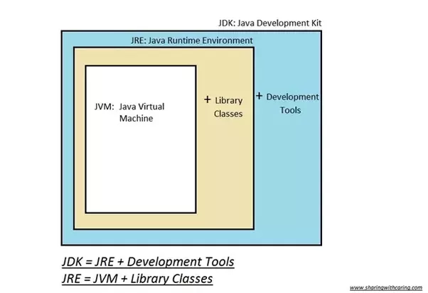

# 자바 개념 정리
## Java Editions
* Java SE – 개인용 개발 환경을 위한 Java
* Java EE – 기업용 개발 환경을 위한 Java
* Java ME – 임베디드 환경을 위한 Java 플랫폼

## 런 타임 과 컴파일 타임
### 런 타임  
 * 컴파일 과정을 마친 프로그램은 사용자에 의해 실행되어지며,
   이러한 응용프로그램이 동작되어지는 때를 런타임이라고 부른다.
### 컴파일 타임 
* 소스코드를 컴파일이라는 과정을 통해 기계어 코드로 변환되어 실행 가능한 프로그램이 되며,
  이러한 편집 과정을 컴파일 타임이라고 부른다.

## JDK

* JRE = JVM + Library Classes
* JDK = JRE + Development Tools

### Oracle JDK: 
* Oracle에서 제공하는 유료 Java 개발 플랫폼. 
* Oracle에서 지적 재산권을 보유한 일부 플러그인이 추가로 제공되며,Oracle로부터 사후 지원을 받을 수 있다. 
* 비상업적인 용도의 사용은 무료로 가능하나, 상업적 용도로 전환하거나 라이센스가 만료되면 
   더이상 Oracle JDK로 개발한 프로그램을 사용해서는 안된다.

### Open JDK: 
* 오픈소스로 제공되는 무료 Java 개발 플랫폼. Java6 시기에는 성능/안정성 측면에서 Oracle JDK와 차이가 있었으나,
  현재는 Oracle이 추가로 제공하는 일부 기능을 제외하면 차이가 없다.
* 그 외 Twitter-JDK, Zulu, Amazon Corretto, AdoptOpenJDK 등 특수 목적에 맞게 튜닝된 JDK 구현체가 서비스되고 있다.
* 참고: Java 언어 자체는 GPL 라이센스로, 무료로 개방되어 있다.

### Java Runtime Environment (JRE)
* Java로 작성된 프로그램을 실행하는 데에 필요한 환경
* Java로 작성된 프로그램은 JDK에 의해 bytecode로 컴파일되며, bytecode는 플랫폼에 종속되어 있지 않다. (Platform-independent)
* JDK를 이용하여 컴파일한 bytecode를 실행하는 Java Virtual Machine (JVM)로 구성되어 있다.
* 특정 머신에서 Java 프로그램을 실행하기 위해서는 해당 플랫폼에 맞는 JVM이 필요하다.

## 클래스
* 문자열(String) - 한번 만든 문자열은 변하지 않는다. (Immutable) 그래서 새로운 문자열을 만들어서 값을 넣어 주는 것과 같다.
* 클래스는 문자열과 달리 mmutable 변할 수 있다.
* 참조형 객체이기 때문에new일때만 새로운 객체를 생성하고,이렇게하면 같은 객체를 가르킨다.
* 이처럼 carThree 에 carOne을 넣었을 때 Three에서 속성 값을 변경시켰을 때 one의 속성값도 변경됨.
```groovy
Car carThree = carOne;

System.out.println(carThree.speed); //carThree.speed = 5;
System.out.println(carThree.speed);// 5
System.out.println(carOne.speed);// 5
```

* 객체는 클래스를 구체화하여 값을 생성하는 것을 객체라 한다.
* 하나의 클래스로 여러개의 객체를 만들 경우, 같은 타입의 `독립적인` 객체가 됨

### 클래스와 객체의 메모리 구조
* 클래스 영역(class area, method area, code area, static area)
   field 정보, method 정보, type 정보, constant pool
* 스택 영역
   method 호출 시 선언된 로컬 변수 -> method 호출이 끝나면 로컬 변수는 사라짐
* 힙 영역
   new 키워드로 생성된 객체들이 메모리에 할당된다.
   garbage collecter 가 활동하는 영역 사용하지 않는 메모리를 청소해줌.
````java
public class MemoryStructure {// 클래스 영역
      
      // 힙 영역 객체에 속하기 때문에 객체를 콜할 때는 힙 영역에 들어감. 객체에 속하는 속성들이므로.
      // 클래스가 아니기 때문에 값 자체가 담긴다.((int이기때문에)32비트 값을 잡아서 쓰여져있음)
      int x, y; 
      
      // 힙영역, 상수 풀에도 생성. 애는 상수풀에 생성됨. 
      // 클래스를 만드는 클래스는 힙영역에있고 내용은 상수풀에 들어감.
      String string = "String!!"; 
     
      // 클래스 영역에 만들어 짐(메소드의 정의)
      // int value = > 스택 영역char c = 'w'; // 스택 영역
      public void method(int value){ 
      
      }
      //대부분의 주소값은64비트 운영체제가 대부분64비트이기때문에 거기에 맞춰지는 것.
}
````
#### String 타입의 메모리 구조
* class, method 같은 것들은 클래스 영역에 만들어지고, 
* method 안에 있는 값들은 스택영역에 만들어졌다가 method의 생명주기가 끝나면 사라짐.
* class 안에 변수들은 힙영역에 생성이 되는데, 정수, 실수형 변수는 constant pool 안에 정의 되어있는 값들을 가져와서 사용하는 것이고, 
  String은 정의할 때 힙 영역에 값이 생성됨.
* 처음에 young메모리(nursery)에 생성되었다가 오랫동안 사용하면 올드메모리로 옮겨짐.
* new로 생성했을 때 기본적으로 young 메모리에 들어간다.

````groovy
@org.junit.Test
public void testStringEquality (){
    final String literal = "Hello";
    final String object = new String("Hello");

    Assert.assertTrue(literal.equals(object));
    Assert.assertFalse(literal == object);
}
````
* 위에서 String의 equals은 true, ==는 false가 나오는 경우를 볼 수 있는데,
* equals는 `문자열`을 비교하고, ==는 객체의 `주소값`을 비교하기 때문이다.


````groovy
@org.junit.Test
public void testStringIntern(){
    final String literal = "Hello";
    final String object = new String("Hello");
    final String intern = literal.intern();

    Assert.assertTrue(literal.equals(object));
    Assert.assertFalse(literal == object);
    Assert.assertTrue(literal.equals(intern));
    Assert.assertTrue(literal == intern);
}
````
위의 코드를 보면 intern()메서드를 호출한 결과값을 intern 변수에 할당되는 것을 볼 수 있다. 
그 후 literal과 object의 동일성(==)과 동등성(equals)를 비교해보면 둘다 true값이 나와 테스트에 성공하게 된다.
리터럴로 "Hello"라는 문자열이 string constant pool에 저장되었고, 
inter() 메서드를 호출하면서 string constant pool에서 Hello라는 문자열을 검색하고 
이미 존재하기 때문에 "Hello" 의 동일한 주소값을 반환하게 되어 true가 나오게 된다.

* String을 리터럴로 선언할 경우 내부적으로 String의 intern()메서드가 호출되게 된다. 
* intern() 메서드는 주어진 문자열이 string constant pool에 존재하는지 검색하고 있다면 그 주소값을 반환 하고,
  없다면 string constant pool에 넣고 새로운 주소값을 반환한다.

## 변수 
### 클래스에 사용되는 변수들(variable)
1. 클래스 멤버 변수(static variable, class variable)
2. 인스턴스 멤버 변수(member variable, attribute...)
3. 로컬 변수(local variable)
4. 로컬 파라미터 변수 (local parameter variable)(arguments)
* 각각의 동작들을 암기하고 어떻게 사용되는지 실제사용방법을 보면서 이해하면됨.

1. 클래스 멤버 변수(스태틱, 정적 변수)
      * static을 이용하여 정의하는 변수를 말하며, 클래스에서 바로 접근하는 변수를 의미 한다.  
      * 객체명으로도 접근이 가능하지만 권장하지 않는다.
      * new 될때마다 새롭게 잡히는 멤버변수와 달리 한번만 메모리가 잡히고 모든 인스턴스가 공유한다. 
      * 처음 프로그래밍에 로드될 때 클래스영역에 생긴다.
      * 인스턴스들이 공동으로 사용하는 변수, 외부에서 접근하지 못하게 private으로 하는게 좋음.
      * 초기화를 안해줬을 경우, 자동으로 자료형의 기본값으로 초기화 됨.(자동으로 초기화가 안이루어지는 경우도 있음.)
  ````groovy
   static int classVar; 
   // 클래스 멤버 변수, 스태틱 변수(정적 변수) 바로 메모리에 올라감.
   
   System.out.println("클래스 변수");
   System.out.println(Variable.classVar); 
   //0으로 초기화됨(외워야 됨 어떤변수들은 초기화가 안이뤄지는 경우도 있음)
   ````
2. 인스터스 멤버 변수(필드, 속성) 
   * 객체를 생성해서 사용하는 변수로 클래스명으로 접근이 불가능하다.
   * 초기화를 안해줬을 경우, 자료형의 기본값으로 자동 초기화 됨.
````groovy
int instanceVar; // 인스턴스 멤버 변수, 필드, 속성
System.out.println("인스턴스 멤버 변수");
Variable var = new Variable();
// 인스턴스를 만들어야 실체가 있기 때문에
System.out.println(var.instanceVar);  
//0으로 초기화가 됨.외워야됨.
````
3. 로컬 변수 
   * 메소드 또는 중괄호 블록 내부에서 생성되는 변수
   * 스택 영역에 생성되며, 초기화가 이루어지지 않음
   * 생명 주기(Life cycle)은 생성된 중괄호 블록이 종료될 때 까지
4. 파라미터 변수 
   * 메소드에서 값을 호출할 때 넣어 주는 변수. 메소드내부에서만 사용 가능.
````groovy
public void method(int paramVar){ //로컬 파라미터 변수
  System.out.println(paramVar);
  int localVar; //로컬 변수
  System.out.println(localVar); //error 로컬변수는 초기화가 자동으로 안됨. 
  localVar = 10;
  System.out.println(localVar); //이렇게 값을 대입해서 사용해야 한다.
  {
    localVar = 30
  };
  int localVar2 = 20;
}
System.out.println(localVar); //블록 내에서 수정한 것도 반영됨.     
localVar2 = 40; // 접근 불가. 생명주기가 끝났다. Life-Cycle이 끝났다.
````
## 메소드 
* 객체가 하는 동작을 정의하는 작업을 수행하는 코드의 집합이자 나열
* 코드의 중복을 방지, 유지보수성을 향상, 코드의 가독성을 개선하는 역할.
````groovy
public int add(int x, int y) {
    return x + y;
}
제한자 리턴타입 메소드명(파라미터타입1 파라미터이름1, 파라미터타입2 파라미터이름2, ...) {
    // 실행문
}
````
### 가변 인자 (Variable Arguments)

* 입력 인자의 개수가 정해지지 않은 경우
````groovy
public int sumAll(int... params) {
    int sum = 0;
    for (int i: params) {
      sum += i;
    }
    return sum;
}
````
### 기본형 vs 참조형 변수
* 기본형: 메소드 인자로 값이 전달됨 (Call by value)
* 참조형: 메소드 인자로 참조가 전달됨 (Call by reference)
````groovy
public class Foo {
    int value;
}

public class Bar {
    public void swapPrimitive(int x, int y) {
        int temp = x;
        x = y;
        y = temp;
    }

    public void swapReference(Foo x, Foo y) {
        int temp = x.value;
        x.value = y.value;
        y.value = temp;
    }
}

Bar bar = new Bar();

int x = 1, y = 10;
bar.swapPrimitive(x, y);
System.out.println(x); // 1
System.out.println(y); // 10

Foo foo1 = new Foo(1);
Foo foo2 = new Foo(10);
bar.swapReference(foo1, foo2);
System.out.println(foo1.value); // 10
System.out.println(foo2.value); // 1
````
### 클래스 메소드 (Class method)
* static 키워드를 이용하여 선언된 메소드
* 인스턴스가 아닌 클래스에 속하는 메소드
* 대표적으로 main 메소드가 클래스 메소드이다.
````groovy
  public class Foo {
    static public void main(String args[]) {
        // class method
    }
}
````

### 메소드 오버로딩
* 동일 기능의 함수를 추가로 구현하는 방법

* 입력 파라미터를 달리하는 동일 함수명으로 구현한다.
```groovy
public class Foo {
    public int sumAll(int ... params) {
        int sum = 0;
        for (int i: params) {
            sum += i;
        }
        return sum;
    }

    public float sumAll(float ... params) {
        float sum = 0.0f;
        for (float x: params) {
            sum += x;
        }
        return sum;
    }
}

Foo foo = Foo();
int sum1 = foo.sumAll(1, 2, 3, 4, 5);
float sum2 = foo.sumAll(1.0f, 2.0f, 3.0f, 4.0f, 5.0f);
```
